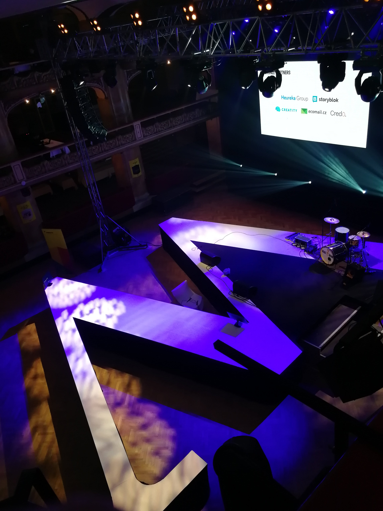

[WebExpo 2022 conference in Prague](https://www.webexpo.net/prague2022) is just around the corner. 10. - 12. June 2022 is approaching and I am looking forward to it.

This year will be a little bit different because of cooperation with the Frontendisti group. On Saturday the entire stage will be only for
frontend topics. You can read more about it from [Martin Michálek on Vzhurudolu.cz](https://www.vzhurudolu.cz)
and [his selection of talks](https://www.vzhurudolu.cz/blog/214-webexpo-2022).

After success with the [First Czech Frontend conference in 2021](https://frontendisti.cz/konference), this is the second time the Frontendisti
introduces itself on this scale.

I hope that I will enjoy this year as much as I do the last one. Let's continue with my program selections…

## Friday schedule

- [Runa Sandvik](https://www.webexpo.net/prague2022/talk/designing-technology-that-enables-free-speech)
  will talk about technologies supporting free speech.
  This is so actual nowadays. I think I want to hear that, especially after the shutdown of disinformation websites in the Czech republic.
- [Prabashwara Seneviratne](https://www.webexpo.net/prague2022/talk/building-pc-game-uis-with-html)
  has talk about using HTML and other web technologies to build games. Maybe you know World of Tanks.
- [Jan Toman](https://www.webexpo.net/prague2022/talk/data-informed-design-systems)
  is our consultant at LMC for the design systems. This is a must-have since we are also building one.
- [Michal Sänger](https://www.webexpo.net/prague2022/talk/graphql-at-scale)
  and **Graphql at Scale** sound very interesting to me. I love this technology.
- [Alexey Sharov](https://www.webexpo.net/prague2022/talk/simple-machine-learning-for-web-developers-from-theory-to-practice)
  and his Simple Machine Learning for Web Developers sounds also very interesting.
  Because I am hearing about machine learning from all around. But everybody is talking about AI. So I need to hear more.
- [Honza Mayer](https://www.webexpo.net/prague2022/talk/jan-mayer) and **#CultureClash** in his company.
  This should be fun. Because he hired a global developer star and was very surprised by what happened.

### Roundtable discussions are better than ever

I was pleasantly surprised by the topics of the roundtable discussions.

- [Robert Jiřík](https://www.webexpo.net/prague2022/talk/roundtable-discussion): **In the times of Agile, is project management dead?**
  This should be an interesting discussion about project management in an agile team.
  Is it project manager still needed if the team is well-organized and self-driven?
- [Pavel Kalandra](https://www.webexpo.net/prague2022/talk/roundtable-discussion-2): **How to find time for technical improvements**
  Adding more new features to the product. Technical debt is growing. How to keep up with technical upgrades and improvements?
  This is a topic with which we are also struggling and do not know how to face.

## Saturday In Cooperation with Frontendisti

The second conference day is full of frontend topics and talks. Check out the **#Frontendisti** hashtag by the talks.

- [Martin Michálek](https://www.webexpo.net/prague2022/talk/frontend-keynote):
  **Frontend Keynote**
- [Honza Sládek](https://www.webexpo.net/prague2022/talk/jan-sladek):
  **State of the CMS**
- [Tomáš Pustelník](https://www.webexpo.net/prague2022/talk/html-can-do-that):
  **HTML can do that?**
- [Michal Matuška](https://www.webexpo.net/prague2022/talk/optimising-core-web-vitals-with-web-fonts):
  **Optimising Core Web Vitals with Web Fonts**
- [Břetislav Proft](https://www.webexpo.net/prague2022/talk/vankova-proft-tba):
  **An Overview of React 18 Feature**
- [Martin Macháček](https://www.webexpo.net/prague2022/talk/remix-run-new-kid-on-the-block-and-is-it-a-competition-for-next-js-and-gatsby):
  **Remix Run - New Kid on the Block, and is it a Competition for Next.js and Gatsby?**
- [Marta Kirchgessner](https://www.webexpo.net/prague2022/talk/how-to-turn-an-agile-retrospective-into-a-teambuilding):
  **How to Turn an Agile Retrospective into Teambuilding**
- [Ondřej Polesný](https://www.webexpo.net/prague2022/talk/how-not-to-fail-when-choosing-a-modern-jamstack-framework):
  **How not to fail when Choosing a Modern Jamstack Framework**
- [Riki Fridrich](https://www.webexpo.net/prague2022/talk/riki-fridrich):
  **Promises are much better than you think**
- [Robin Pokorný](https://www.webexpo.net/prague2022/talk/railway-oriented-typescript):
  **Railway Oriented Typescript**

### Non-frontend talks and discussions

- [Vitaly Friedman](https://www.webexpo.net/prague2022/talk/designing-for-complex-uis) about designing for complex UIs.
- [Evgeny Kot](https://www.webexpo.net/prague2022/talk/roundtable-discussion-6)
  discussion about top 10 trends in frontend development.

## Eyecatchers

- [Daniel Cuthbert](https://www.webexpo.net/prague2022/talk/git-push-git-impact):
  **Git Push & Git Impact**
  Something about security around git commits.
- [Veronika Mourková](https://www.webexpo.net/prague2022/talk/have-big-and-exciting-projects-but-lack-team-motivation-and-capacity-here-are-the-pitfalls-to-avoid):
  **Have big and Exciting Projects but Lack Team Motivation And Capacity? Here are the Pitfalls to Avoid**
  Veronika is a colleague of mine and this is about day-to-day problems.
- [Robert Fujdiar](https://www.webexpo.net/prague2022/talk/growing-up-how-a-small-team-scales-agility):
  **Growing Up: How a Small Team Scales Agility**
  This is about how to grow up in a small team.
- [Jakub Kadlubiec](https://www.webexpo.net/prague2022/talk/roundtable-discussion-3):
  **Building Self-Organized Software Development Teams**
  Roundtable Discussion
- [Design Systems](https://www.webexpo.net/prague2022/talk/roundtable-discussion-4):
  **Experiences From the Trenches** Roundtable Discussion
- [Adam Amran](https://www.webexpo.net/prague2022/talk/roundtable-discussion-5):
  **Effective Collaboration between Desing, Product, and Engineering** Roundtable Discussion
- [Eva Pavlíková](https://www.webexpo.net/prague2022/talk/eva-pavlikova):
  **Expert Volunteering is not a Charity**
  About volunteering in [Cesko.Digital](https://cesko.digital/)
- [Philip Bonhard](https://www.webexpo.net/prague2022/talk/alice-who-the-f-ck-is-alice-the-challenges-of-digital-identity-in-a-post-covid-tinder-swindler-world):
  **Alice, Who The F\*ck is Alice? The Challenges of Digital identity in a Post-Covid, Tinder Swindler World**
  Crazy title that cought my eye. Something about digital identity and security.
- [Marek Trunkát](https://www.webexpo.net/prague2022/talk/how-i-learned-to-love-incidents-the-hard-way):
  **How I Learned to Love Incidents the Hard Way**
- [David Müller](https://www.webexpo.net/prague2022/talk/roundtable-discussion-8):
  **Roundtable Discussion: From Developer to Manager**
  How to become manager from a developer.

### What to do on WebExpo next

Kids are welcome at this venue. Last year I and my son enjoyed building and playing with lego robots and ozobots.
This time I will be babysitting all of my three children. So it will be much more fun. Check out [the workshops for kids](https://www.webexpo.net/prague2022/talk/workshop-for-kids-lounge-area-for-parents-with-babies).

Also do not miss Friday and Saturday [parties](https://www.webexpo.net/prague2022/venue) ;-)

**See ya on WebExpo!**

