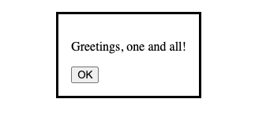
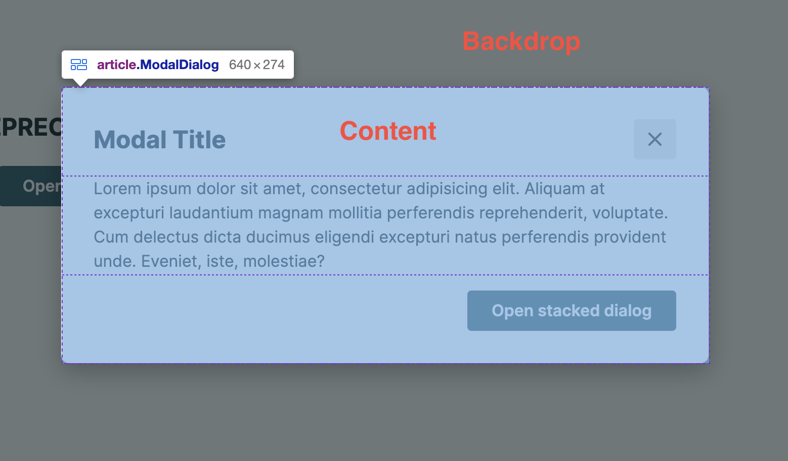
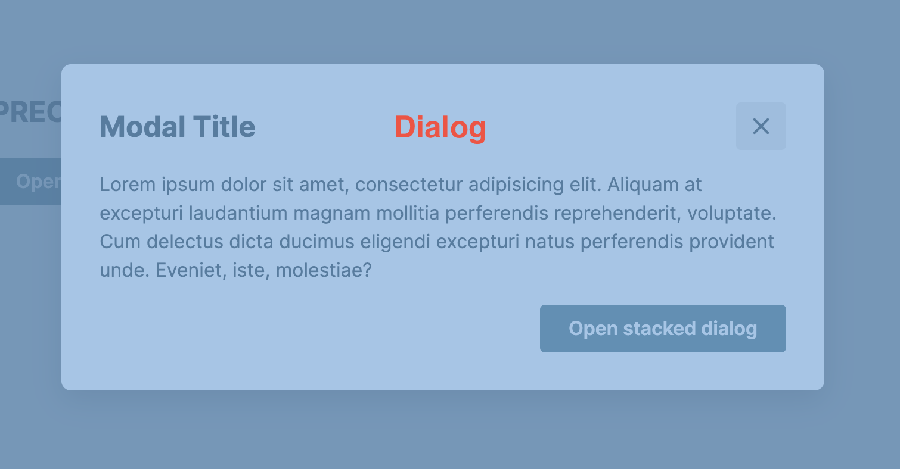

Every UI library [names components](https://component.gallery/components/modal/) a little differently.
As for anatomy and implementation, components are often similar to each other (although each may be [suitable for different purposes](https://orbit.kiwi/components/overlay/modal/#when-to-use)).
However, we encounter one variant of such a component almost everywhere.
And that is the Modal.
Sometimes it is called Dialog or Popup.
In various mutations, it also appears as Drawer or Offcanvas (dialog that slides from the side).
But they all have one thing in common.
They appear above the current interface and prioritize a specific action or information for the user.
And in all cases, their implementation is quite complex.
Let's take a look at how to simplify and improve such implementation using the native element `html»<dialog>`.

## Meet the dialog element

](./modal-anatomy-adobe.png)

](./modal-anatomy.png)

Some of us have surely struggled with creating and styling modals. It's always the same:

- build the dialog and its content,
- create an overlay with a darkened backdrop,
- create an API for opening and closing the entire modal,
- then solve closing when pressing the Escape key, clicking outside the `html»<dialog>` (on the backdrop), and other edge cases (such as [preventing scrolling](https://github.com/react-ui-org/react-ui/pull/432#discussion_r1052472103) on the page).

So many things that repeat themselves, and yet we have the dialog element that serves all of this on a silver platter.
And at the same time, it solves accessibility.

The first glimpse of the dialog element was shown to us by Tomáš Pustelník in his lecture at WebExpo - [HTML can do that](https://www.youtube.com/watch?v=rM1emdWTr5Q). Let's recap.

The dialog element itself is a relatively simple element.
It doesn't have any additional properties except for the "open" attribute, which determines whether the dialog is initially open or not.
However, be aware that a dialog opened via the "open" attribute is not modal and there is no method to reopen it.
Controlling it through JavaScript is the preferred method, but more on that later.

```html
<dialog open>
  <p>Greetings, one and all!</p>
  <form method="dialog">
    <button>OK</button>
  </form>
</dialog>
```



](./nonmodal-dialog-2.png)

It becomes interesting only when combined with the `html»<form>` element, if it has the attribute `method="dialog"` or if the submit button has `formmethod="dialog"`.
In such a case, the form state is saved, the dialog is closed, and the return value `dialog.returnValue` is set to the value of the button.

```html
<main>
  <button id="open">Open dialog</button>
  <dialog>
    <form method="dialog">
    <h1>Hello, would you like to do something cool?<h1/>
    <button id="close" value="cancel">Go to hell!</button>
    <button id="confirm" value="confirm">Let's go!</button>
  </dialog>
</main>
```

However, that's not all. The dialog element also adds a new pseudo-element, `css»::backdrop`, which allows easy styling of the backdrop that appears behind the dialog.
For example, to achieve a darkening effect on the inaccessible content.

```jsx
.Modal::backdrop {
  background-color: #333333;
  visibility: visible;
  opacity: 1;
}
```

## Close me and open me again, with JavaScript of course

And now for the controls, because not everything works automatically and a bit of JavaScript is always needed.
However, even here, `html»<dialog>` saves us some typing and offers us several options for interacting with it.

### Methods

`.show()`

I will start with a method that may initially give the impression of an inconsistent API.
The show() method does not display the dialog as the developer would expect, in Modal state.
This method opens the Dialog in so-called non-modal state, where interaction with content outside the dialog is still allowed.
It's similar to the open attribute that I described at the beginning.

`.showModal()`

This is the real method you want to use to open the dialog.
The dialog opens as we all know, over all other dialogs, to the top layer.
The `::backdrop` pseudo-element is activated and interaction with content outside the dialog is blocked.

`.close()`

Closing `html»<dialog>` is already easy, there is only one method for that, which also accepts a return value as an argument that we want to get into `dialog.returnValue`.

### Events

The `html»<dialog>` element also triggers two events.

`close`

→ The close event is triggered when the dialog is closed by a button.

`cancel`

→ The cancel event is triggered when the dialog is canceled, for example by pressing the Escape key. This automatically closes the dialog and eliminates the need for further implementation.

```jsx
<script>
  (() => {
    const updateButton = document.getElementById("updateDetails");
    const closeButton = document.getElementById("close");
    const dialog = document.getElementById("favDialog");
    dialog.returnValue = "favAnimal";

    function openCheck(dialog) {
      if (dialog.open) {
        console.log("Dialog open");
      } else {
        console.log("Dialog closed");
      }
    }

    // Update button opens a modal dialog
    updateButton.addEventListener("click", () => {
      dialog.showModal();
      openCheck(dialog);
    });

    // Form close button closes the dialog box
    closeButton.addEventListener("click", () => {
      dialog.close("animalNotChosen");
      openCheck(dialog);
    });
  })();
</script>
```

Then all you have to do is handle closing when clicking on the backdrop and you're done.
But even here the solution is simple, because clicking on the backdrop passes `event.target` as the dialog element.
Therefore, it is enough to compare whether the click was on the content or on the dialog element itself and close it accordingly.





## And what about React?

The implementation in React has been significantly simplified.

Let's start with the Modal component itself using the dialog element and a reference to it.

```jsx
function Modal({ children }) {
  const dialogRef = React.useRef(null);

  return <dialogref={dialogRef}>{children}</dialog>;
}

```

Next, we need to control the open or closed state using the methods described above.

```jsx
function Modal({ children, open }) {
  const dialogRef = React.useRef(null);

  React.useEffect(() => {
    const dialogNode = dialogRef.current;

    if (open) {
      dialogNode.showModal();
    } else {
      dialogNode.close();
    }
  }, [open]);

  return <dialog ref={dialogRef}>{children}</dialog>;
}
```

Then it's just a matter of handling what should happen when someone presses Escape and the cancel event is triggered.

```jsx
function Modal({ children, open, onRequestClose }) {
  const dialogRef = React.useRef(null);

  React.useEffect(() => {
    const dialogNode = dialogRef.current;

    if (open) {
      dialogNode.showModal();
    } else {
      dialogNode.close();
    }
  }, [open]);

  React.useEffect(() => {
    const dialogNode = dialogRef.current;
    const handleCancel = (event) => {
      event.preventDefault();
      onRequestClose();
    };

    dialogNode.addEventListener('cancel', handleCancel);

    return () => {
      dialogNode.removeEventListener('cancel', handleCancel);
    };
  }, [onRequestClose]);

  return <dialog ref={dialogRef}>{children}</dialog>;
}
```

And as a cherry on top, we can also add the focus returning to the element that opened the modal, as recommended by WAI-ARIA.

```jsx
function Modal({ children, open, onRequestClose }) {
  //  ...
  const lastActiveElement = React.useRef(null);

  React.useEffect(() => {
    const node = ref.current;

    if (open) {
      lastActiveElement.current = document.activeElement;
      node.showModal();
    } else {
      node.close();
      lastActiveElement.current.focus();
    }
  }, [open]);
  //  ...
}
```

Or you can break down the entire implementation into hooks and the Dialog component itself, and then assemble it like LEGO, as we did in the [Spirit Design System](https://github.com/lmc-eu/spirit-design-system/tree/main/packages/web-react/src/components/Dialog).

## What to take away from this

**Advantages:**

- Minimal JavaScript is needed.
- Accessibility is almost solved [except for a few problems with autofocus](https://www.scottohara.me/blog/2023/01/26/use-the-dialog-element.html).
- There is a `::backdrop` pseudo-element that can be easily styled.
- The form attribute `method="dialog"` exposes form values and buttons when used in a dialog.
- Pressing the `Escape` key automatically closes the dialog.

**Disadvantages:**

- More advanced functionality requires more JavaScript, but not that much more ;-)
- Clicking on the backdrop does not close the dialog automatically, so a little bit of JavaScript is needed.
- Some minor accessibility issues, see [autofocus](https://www.scottohara.me/blog/2023/01/26/use-the-dialog-element.html).

**Accessibility**

As shown in the following table, the dialog element can already be used in the vast majority of browsers, and work is underway on [solutions to some of the remaining issues](https://github.com/whatwg/html/commit/a9f103c9f7bd09ef712990194638c75db1f50e3c).

](./dialog-caniuse.png)

Therefore, if your website does not require any special features such as support for very old browsers or if you do not have extremely limited resources or time, I recommend migrating to the dialog element.
There will always be cases where `role="dialog"` is preferred over the `html»<dialog>` element, but there will be fewer and fewer of them.

However, if you do not want to add additional dependencies that would solve any Dialog-related issues, even if they are very small, use the `html»<dialog>` element.
After all, you don't want to reinvent the wheel, or rather the Dialog :-)

## References

- [The Dialog element - HTML: HyperText Markup Language | MDN](https://developer.mozilla.org/en-US/docs/Web/HTML/Element/dialog)
- [HTMLDialogElement.show() - Web APIs | MDN](https://developer.mozilla.org/en-US/docs/Web/API/HTMLDialogElement/show)
- [HTMLDialogElement.showModal() - Web APIs | MDN](https://developer.mozilla.org/en-US/docs/Web/API/HTMLDialogElement/showModal)
- [HTMLDialogElement: close event - Web APIs | MDN](https://developer.mozilla.org/en-US/docs/Web/API/HTMLDialogElement/close_event)
- [HTMLDialogElement: cancel event - Web APIs | MDN](https://developer.mozilla.org/en-US/docs/Web/API/HTMLDialogElement/cancel_event)
- [::backdrop - CSS: Cascading Style Sheets | MDN](https://developer.mozilla.org/en-US/docs/Web/CSS/::backdrop)
- [Tomáš Pustelník - HTML can do that?](https://www.youtube.com/watch?v=rM1emdWTr5Q)
- ["dialog" | Can I use... Support tables for HTML5, CSS3, etc](https://caniuse.com/?search=dialog)
- [Build a Dialog Component in React](https://souporserious.com/build-a-dialog-component-in-react/)
- [Use the dialog element (reasonably)](https://www.scottohara.me/blog/2023/01/26/use-the-dialog-element.html)
- [Modal | lmc-eu/spirit-design-system](https://github.com/lmc-eu/spirit-design-system/tree/main/packages/web/src/scss/components/Modal)
- [Modal.ts | lmc-eu/spirit-design-system](https://github.com/lmc-eu/spirit-design-system/blob/main/packages/web/src/js/Modal.ts)
- [Dialog.ts | lmc-eu/spirit-design-system](https://github.com/lmc-eu/spirit-design-system/tree/main/packages/web-react/src/components/Dialog)
- [Dialog](https://open-ui.org/components/dialog.research)
- [Modal](https://component.gallery/components/modal/)
- [Modalz Modalz Modalz](https://modalzmodalzmodalz.com/)
- 📷 [Jakson Sophat](https://unsplash.com/@jacksonsophat) - [html](https://unsplash.com/photos/wUbNvDTsOIc)
