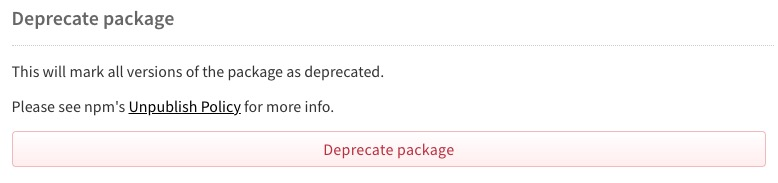
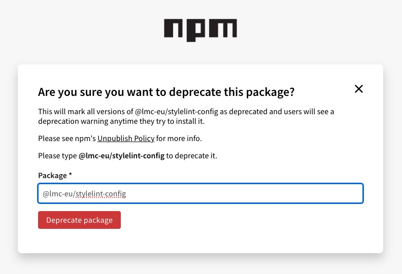
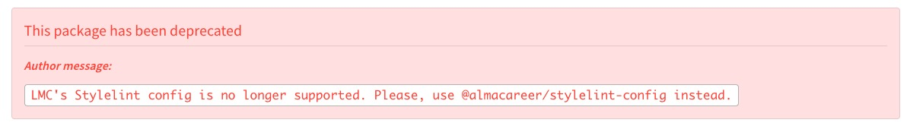

There comes a time when we no longer want to maintain a package or its version.
For me, at Alma Career Company, it was a time when the company was in the process of renaming.
Alma Media is an owner of a former LMC company (Czech job portals) and thus the new brand Alma Career was born.

This change requires us also to rename our scopes of public packages like the `@lmc-eu` was.
We have created a new scope `@almacareer` and renamed our packages with this scope.

This is obviously a breaking change.
But how should we signal to the developers that the new version is available in a different scope?
And also how to signal that the old version is no longer maintained?

The answer is "deprecation".

The npm has a built-in mechanism for this.

## Deprecating a Package on the npm Website

Deprecating a package on a npm web app is quite a simple and straightforward process.

Just got to the settings of the package and click on the "Deprecate" button.



Type in the name of the package.



The package is now deprecated with some default message.


This is nice and straightforward but has some drawbacks.
It deprecates the whole package and all its versions.
In our case, it is what we wanted.

But the message does not tell anything about the new package in the new scope.

There must be another way.

## Deprecating a Package Using CLI

npm CLI provides us with a more precise and flexible tool for deprecating not only the whole package but also its versions.

And above all, we can add to each deprecation some nice custom message.

```bash
npm deprecate <package-name>@<version> "<message>"
```

```bash
npm deprecate @lmc-eu/stylelint-config "LMC's Stylelint config is deprecated. Please use @almacareer/stylelint-config instead."
```

The outcome is obviously better and the developers will be informed about the new package's scope.



## Summary

When deprecating npm packages, you have two options:

- Using the npm website for deprecating entire packages with default messages
- Using npm CLI (`npm deprecate <package>@<version> "<message>"`) for more granular control and custom deprecation messages

The CLI approach is recommended when you need to guide users to new package locations or communicate specific migration instructions.

## References

- [Deprecating and undeprecating packages or package versions][npm-deprecated-package]
- [Old scope Stylelint config][lmc-stylelint-config]
- [New scope Stylelint config][alma-stylelint-config]
- 📷 [Debora Rousse][debora-rousse] - [rusty iron nails][rusty-nails]

[debora-rousse]: https://unsplash.com/@debora_rousse
[rusty-nails]: https://unsplash.com/photos/gray-nail-lot-on-floor-NpIZhur97aA
[npm-deprecated-package]: https://docs.npmjs.com/deprecating-and-undeprecating-packages-or-package-versions
[lmc-stylelint-config]: https://www.npmjs.com/package/@lmc-eu/stylelint-config/
[alma-stylelint-config]: https://www.npmjs.com/package/@almacareer/stylelint-config
