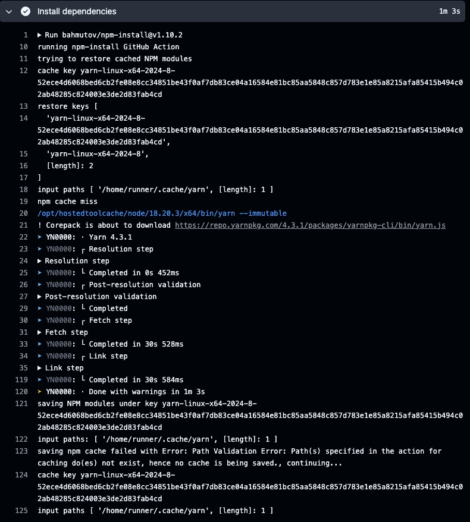

Since migrating a few of my projects to [Yarn Modern][yarn], I have been struggling with speeding up the dependency installation process on [GitHub Actions][github-actions].

From the beginning, I have been using the great [`bahmutov/npm-install`][npm-install] action that handles the caching of `node_modules` for Yarn v1.22.22 very well.

With the configuration looking like this...

```yaml
- name: Install dependencies
  uses: bahmutov/npm-install@v1.10.2
  with:
    useRollingCache: true
    install-command: yarn --immutable
```

...the caching was working great and the CI runs were fast.

## Missing the Cache

However as I started to migrate the project to Yarn v3 and v4, I noticed that the cache was consistently missed.



There is still an open GitHub issue [bahmutov/npm-install#28][npm-install-cache-miss] that is tracking this problem.

## Re-enable the Caching

I have started investigating how to achieve better performance for Yarn Modern while installing dependencies on GitHub Actions.
I have discovered a few viable solutions worth sharing.

### Discord's Custom Cache Action

In a Discord repository, I have found a custom caching action that is handling the caching using `actions/cache`.

The solution is simple:

- Restore yarn cache
- Restore cache state
- Install dependencies

You can check their implementation in the [Discord repository][discord-properly-cache-yarn].

This is a good and usable solution if you want to take care of the caching yourself. But I did not want to deal with this.

### Setup Node with Cache

I am also using the [`actions/setup-node`][setup-node] for configuring the Node.js environment for me.
And in one of their [most recent release][setup-node-with-cache] I discovered that they have added a new feature for caching the `node_modules` directory.

> Caching dependencies
>
> The action has a built-in functionality for caching and restoring npm/yarn dependencies.
> Supported package managers are npm, yarn. The cache input is optional, and caching is turned off by default.

```yaml
- name: Enable Corepack
  run: corepack enable # Set up a package manager for us

- name: Configure Node
  uses: actions/setup-node@v4
  with:
    node-version-file: '.nvmrc' # Use node version file
    cache: 'yarn' # 'npm' or 'yarn'

- name: Install dependencies
  run: yarn --immutable --inline-builds
```

Since using this configuration, I have been able to **speed up** my dependency installation process on GitHub Actions **twice**.

## References

- [Setup Node with cache][setup-node-with-cache]
- [NPM install cache miss][npm-install-cache-miss]
- [Discord's custom cache action][discord-properly-cache-yarn]
- [Effectively restoring Yarn cache][setup-node-restore-cache]
- 📷 [Richy Great](https://unsplash.com/@richygreat) - [GitHub Screen](https://unsplash.com/photos/white-and-silver-electronic-device-MAYEkmn7G6E)

[discord-properly-cache-yarn]: https://github.com/discordjs/discord.js/commit/c0e3629f64042c7363f9dae6830bc2f6a7e5c7d4
[github-actions]: https://github.com/features/actions
[npm-install]: https://github.com/bahmutov/npm-install
[npm-install-cache-miss]: https://github.com/bahmutov/npm-install/issues/28
[setup-node]: https://github.com/actions/setup-node
[setup-node-restore-cache]: https://github.com/actions/setup-node/issues/834
[setup-node-with-cache]: https://github.com/actions/setup-node/releases/tag/v2.2.0
[yarn]: https://yarnpkg.com/
