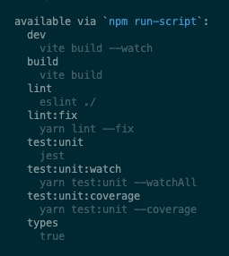

When working on any project in the JavaScript ecosystem, I encounter a recurring
problem: How will the project be managed?

I'm talking about npm scripts, which nowadays have fully replaced tools like
Grunt, Gulp, or Yeoman.

The npm scripts can define many useful commands that are great for running
tests, starting local development, or deploying to production. However,
the problem that remains is that each developer names the scripts in their way,
which makes switching between projects difficult for developers. Each project
thus has its own set of commands that need to be relearned. There is
no standard named set of scripts that would have to be the same for every project,
thus guaranteeing that the projects will, at least in principle, be handled the same way.

## How to navigate npm scripts

The JSON format, and thus `package.json` itself, doesn't give us much means
of naming or organizing the scripts themselves.

As a person used to the Linux environment, I would expect some sort of help format
for npm scripts as well. Simply using `npm/pnpm/yarn -h` will only output
the help itself, and no longer information about the available scripts.


Fortunately, the developers of package managers have thought about this a bit,
so I can list the available npm scripts with `npm/yarn/pnpm run`. But also with
the full content of the script. I don't usually want to look at the scripts
themselves, a dev: run local development comment would be more useful.



I wish I had a way to describe the scripts better…
I once wrote [an article on how to use Makefile comments to create self-documenting help][makefile-project-orchestration]
about available scripts. It works quite simply, each script has a comment that
can be processed and output as a help in the console.

Unfortunately, even something as simple as `package.json` doesn't work.
It would help a lot if I could assign a custom comment to each script,
but JSON as a format doesn't allow this.

However, times are evolving and the JSON5 or JSONC specification already allows
comments in JSON. Unfortunately, despite [proposed RFCs][json-rfc]
for comments or [RFC for JSON5][json5-rfc] or
[queries about JSON5 support][json5-support],
npm still does not take these requests from developers into account, citing that
[Node.js also does not support JSON5][node-json5-support].
So there are still not many ways to get package.json into a more readable form.

## Naming conventions

The only solution we have left is to set naming conventions for naming npm scripts
and follow them. In the next part of this article, we'll look at how I approached
this problem in my projects. I will present a system I developed that has worked
well for me in organizing npm scripts.

### Universal script

In a pull request, my colleagues and I were discussing that we needed a single
script to check the whole project. At the time, options such as `all`, `ci`, or
`check` seemed like a pretty good idea, but we gradually realized that none of
them suited us. The `all` was based on local use in PHP projects, but the name
itself is confusing. What all will it actually run? Again, `ci` was supposed
to simulate a CI pipeline, but here too we ran into the existing native `npm ci`
script. And `check` failed again because of running unit tests etc...

However, I soon found out that there was actually nothing to invent, because
npm had already sort of solved this problem for me. When running `npm init` and
thus generating `package.json` for a new project, the only existing script is `test`.
And that was it. Even according to [documentation][npm-test],
this is supposed to be the script that tests the whole package.


> From my experience, the `npm test` (or `yarn test`) is what everyone expects to be present
> in every (or almost every) package. As a developer, I switch from one package
> to another on a daily basis and this is precisely what I appreciate to be the
> same everywhere. It's far more convenient to know I can rely on the `npm test`
> (or `yarn test`) in all projects then having to remember different testing tasks
> names across different projects. It's a part of the standard set of tasks: the
> built-in `install` (or `ci`), then `build`, `test`, and `start`.
>
> [LMC's Cookie Consent Manager Review Comment][lmc-cookie-consent-manager-review]

Thus it was decided that each project will at least contain a `test` script
that will run a check/test of the whole project. So not only unit tests,
but also various other lints, type checks, and everything around to make sure
the package or project is in perfect order.

Then, as it turns out, npm has other documented scripts besides
[`test`][npm-test] such as [`start`][npm-start],
[`stop`][npm-stop], and [`restart`][npm-restart].

And so the first rules began to take shape:

- `start` - starts the project
- `stop` - stops the project
- `test` - tests the whole project

### Namespaces and aliases

Of course, you need a bit more commands than just start, stop, and test to control
the whole project. The vast majority of projects still need to be built (build),
code checked (lint), formatting checked, type checked (if you use TypeScript), and
not to mention various tests like unit tests or end-to-end tests. This deepens
our need to name everything well.

So, not to reinvent the wheel completely, we decided to investigate how other
large projects can handle this problem. Of primary note here is
[Bootstrap][bootstrap-pkg], which has
scripts split by context and uses the hyphen `-` as a separator. This allows it
to define a "namespace" in which the shortest statement always triggers everything
else that occurs in the namespace.

However, when using the hyphen, I run into a bit of a problem with two-word
commands that then get lost in the whole context. So I had to find a better
delimiter. In this case, Gulp helped me a bit with its style of separating
commands using the colon `:`. This made defining contexts nicely clearer and,
in combination with the hyphen, allowed me to combine multi-word commands as well.

**Current rules:**

- namespace name is separated by `:`
- multi-word expressions are separated by `-`
- the namespace name is always an alias to start the entire namespace
- there is always a test command that tests the entire project

And with that, we could start composing.

Let's start with the `test` command.
Under this, we expect to test the whole project, so unit tests, end-to-end tests,
linting, formatting, type, etc...

```jsonc
"test":               // starts testing the whole project (test:unit, lint, types, format)
"test:unit":          // runs unit tests
"test:e2e":           // runs end-to-end test
"lint":               // runs lint
"lint:scripts":       // starts JavaScript linting
"lint:scripts:fix":   // runs the JavaScript fixer
"format":             // runs format check (Prettier)
"types":              // runs type check
```

With the above-mentioned rules, the entire command structure can be extended
and scaled freely. If we also define the commands that must always be present
in the project and their exact names within the rules, we can move from project
to project with the certainty that the basic set of scripts will always be present.
The whole set can then look like the example below 👇🏼

```json
"scripts": {
    "dev": "start the development",
    "start": "start the production",
    "build": "build the project",
    "clean": "clean build files and other things",
    "test": "main script for testing entire project",
    "test:unit": "run unit tests",
    "test:unit:ci": "run unit tests for CI",
    "test:unit:local": "run unit tests on local",
    "test:unit:watch": "run unit tests in watch mode",
    "test:unit:coverage": "run unit tests with code coverage",
    "lint": "main linting script",
    "lint:scripts": "run ecma script linting",
    "lint:scripts:fix": "run ecma script fixing",
    "lint:commit": "lint commit",
    "lint:markdown": "lint markdown",
    "lint:text": "lint text",
    "lint:text:fix": "fix text",
    "format": "run format checker",
    "format:fix": "run format fixer",
    "types": "run type checking"
},
```

**Complete rules:**

- namespace name is separated by `:`
- multi-word expressions are separated by `-`
- the namespace name is always an alias to start the entire namespace

**List of mandatory scripts:**

- `test` - tests the entire project
- `test:unit` - runs unit tests
- `lint` - executes links
- `format` - runs format check
- `types` - runs type check
- `build` - builds the project
- `dev` - starts local development
- `start` - starts production configuration
- `release` - prepares a new release
- `deploy` - uploads the project to the runtime environment (production, preproduction, staging, etc.)

## Running a group of scripts

Due to the above-described naming of scripts and their merging into whole namespaces,
it is necessary to run all these scripts as well. There are two possible ways to
do this. Each has its advantages and disadvantages, which we will now discuss in more detail.

First is the classic use of shell operators such as `;` and `&&` to run scripts
in series or `&` to run scripts in parallel.

It then looks like this:

Parallel:

```json
"lint": "lint:scripts & lint:css & lint:html"
```

Series:

```json
"lint": "lint:scripts; lint:css; lint:html"
```

This solution works pretty cool, but it's one bigger problem. When using `&`,
a subprocess is created, which in effect causes the original `npm` process to be
unable to tell if the subprocess ran fine or not. And this can be a problem,
especially in the case of long-running scripts.

> Just be careful when using `;`. The following command will always be executed
> regardless of the return value of the first one. So if the first lint fails,
> the next one goes on just fine. If we want to change this behavior, just use `&&`.
> And that way if the first command fails with a return value other than `0`
> (which means successful execution), the next command will not run anymore.
> Of course, you can chain it however you like.

```json
"lint": "lint:scripts && lint:css && lint:html"
```

However, there is a second option to solve this problem. And that is to use a package called `npm-run-all`

> Use the `npm-run-all2` package, because the author of the original package
> no longer maintains the project, so a fork was created to maintain this very useful package.

This package thus comes with two scripts, `run-s` for serial processing and `run-p`
for parallel, which can be used to call individual scripts.

Parallel:

```json
"lint": "run-p lint:scripts lint:css lint:html"
```

Series:

```json
"lint": "run-s lint:scripts lint:css lint:html"
```

However, for better script readability, I recommend using the full name `npm-run-all`
with the `--parallel` or `--serial` switches. While the notation is not as economical,
on the other hand, it is more obvious what the script is doing.

Parallel:

```json
"lint": "npm-run-all --parallel lint:scripts lint:css lint:html"
```

Series:

```json
"lint": "npm-run-all --serial lint:scripts lint:css lint:html"
```

Another great advantage of `npm-run-all` is that it can use the wildcard `*` as
a wildcard to replace a group of expressions. Thanks to this and also to defining
namespaces with `:`, we can simplify the whole entry for a group of commands to:

```json
"lint": "npm-run-all --serial lint:*"
```

In this case, it will find and execute all scripts starting with lint: in the series.

## What about life-cycle hooks?

It's a nice feature of npm that when running any script, it throws so-called
life-cycle hooks. Or `pre` and `post` scripts. So not only does it run the script
itself (in this case `lint`), but it tries to run the `prelint` script before it,
and the `postlint` script after it. The whole thing then looks like this:

- `prelint`
- `lint`
- `postlint`

This is great if you need to do some prep work before the script itself and
some cleanup after. But there's an ALE to this. In the case of naming, this can
lead to all sorts of confusion as to when to drop what, even complete confusion.
A good example would be `start` and `prestart`, or the script `serve` and its hook
`preserve`, where suddenly the meaning changes completely. Based on these issues,
for example [Yarn completely removed support][yarn-lifecycle-scripts]
for `pre` and `post` hooks for most scripts.

> In particular, we intentionally don't support arbitrary `pre` and `post` hooks for
> user-defined scripts (such as `prestart`). This behavior caused scripts to be implicit
> rather than explicit, obfuscating the execution flow. It also sometimes led to
> surprising behaviors, like `yarn serve` also running `yarn preserve`.

In that respect, this move seems quite reasonable to me. I came across it while
migrating to Yarn Modern, but I'll talk about that another time.

The question remains, however: If I'm losing support for `pre` and `post` hooks,
how do I resolve the naming so that the scripts are clear and explicit?

The solution is easy, though it requires a bit more typing. I decided to replace
`pre` and `post` with `prepare` and `finalize`. Both in the same form express exactly
what I want to say, now something is being prepared and now finalization is taking place.

The resulting lifecycle then looks like this:

- `build:prepare`
- `build`
- `build:finalize`

If you then combine this with everything I wrote above, the following is the way it looks to me:

```json
"build": "npm-run-all --serial build:prepare build:compile build:finalize",
"build:prepare": "shx rm -rf dist",
"build:compile": "rollup",
"build:finalize": "mv package.json dist/"
```

It's maybe a little more writing than necessary, but I think it's clearly readable and scalable for everyone.

## Script order

The overall readability of the scripts can be increased a bit more by properly
ordering the scripts in `package.json`. Sorting scripts alphabetically may seem
like the simplest option, which may look nice and tidy, but may not be appropriate given the context.

In practice it is more efficient to sort scripts by context, the `build` script
mentioned above is an example. The alias (the main call of the entire context)
is listed first, and the following lines list the scripts used.

Entire blocks can then be either sorted alphabetically or, which is often
a better solution, by the frequency of script usage by the developer.
In most cases, the key to working with a new project is to start development
as easily and quickly as possible. This is why scripts like `start` or `dev`
are placed at the beginning. Scripts important for development such as `test`,
`lint`, `types`, etc. are next, followed by scripts related to builds and deploys.
At the end are handler and helper scripts that do not belong to any context.

The whole thing can then look like the following example 👇

```json
"scripts": {
    "prepare": "is-ci || husky install",
    "start": "yarn packages:start --ignore '@almacareer/spirit-example*'",
    "storybook": "lerna run start --scope=@lmc-eu/spirit-storybook",
    "test": "yarn packages:test",
    "test:unit": "yarn packages:test:unit",
    "test:e2e": "yarn playwright test",
    "test:e2e:update": "yarn playwright test --update-snapshots",
    "test:e2e:report": "yarn playwright show-report",
    "test:e2e:ui": "yarn playwright test --ui",
    "lint": "npm-run-all --parallel es:lint lint:markdown packages:lint",
    "lint:fix": "npm-run-all --parallel es:lint:fix packages:lint:fix",
    "lint:markdown": "remark ./ --quiet",
    "lint:commit": "yarn commitlint --verbose --color --from $(git merge-base origin/main HEAD)",
    "es:lint": "eslint ./",
    "es:lint:fix": "yarn es:lint --fix",
    "format": "yarn format:check",
    "format:check": "prettier --check ./",
    "format:fix": "prettier --write ./",
    "format:fix:changelog": "prettier --write ./**/CHANGELOG.md",
    "types": "yarn packages:types",
    "build": "npm-run-all --serial packages:build:libs packages:build:web",
    "version": "yarn format:fix:changelog",
    "release": "npm-run-all --serial packages:build && packages:publish",
    "packages:start": "lerna run start --parallel",
    "packages:test": "lerna run test",
    "packages:test:unit": "lerna run test:unit",
    "packages:lint": "lerna run lint --parallel --no-sort",
    "packages:lint:fix": "lerna run lint:fix --parallel",
    "packages:types": "lerna run types --no-sort",
    "packages:build:libs": "lerna run build --ignore '@lmc-eu/spirit-web*' --ignore=@lmc-eu/spirit-demo-app --ignore=@lmc-eu/spirit-storybook --ignore '@almacareer/spirit-example*'",
    "packages:build:web": "lerna run build --scope '@lmc-eu/spirit-web*' --ignore=@lmc-eu/spirit-demo-app",
    "packages:publish": "lerna publish",
    "packages:diff": "lerna diff",
    "packages:changed": "lerna changed",
    "packages:list": "lerna ls"
},
```

## In conclusion

In today's article, I showed that naming npm scripts and building their logic in
a way that someone else can understand is really hard. However, I have now presented
a really robust system for approaching scripts in a sustainable way in the future,
both on the naming side and on the execution side.

Only the future will tell then if npm authors start supporting at least the JSON5
format or add another way to better describe what the scripts do and when to run them.
Until then, I have to make do with good, understandable, and explicit naming.

In today's article, I've covered the issue of naming and organizing npm scripts
in detail. I showed that although this is a challenging task, there are effective
ways to approach it. I presented a robust system that includes:

1. consistent naming conventions using the separators "`:`" and "`-`"
2. Namespace creation for better script organization
3. Using aliases to simplify the execution of groups of scripts
4. Efficient use of tools like `npm-run-all` for parallel and serial script execution
5. Replacing `pre` and `post` hooks with more explicit names like `prepare` and `finalize`

This approach not only improves the readability and sustainability of your projects,
but also facilitates team collaboration and transition between different projects.

Although the current limitations of the JSON format in `package.json` present
a challenge, I believe that over time the situation will improve. Perhaps in the
future, we will see support for JSON5 or another solution that allows for better
documentation of scripts directly in the project configuration.

Until then, we have no choice but to stick to the good practices I have described
in this article. Remember, consistency, clarity, and explicitness in naming your
scripts are the keys to success.

## References

- [Bootstrap and its package.json][bootstrap-pkg] - Example of a large project with well-organized scripts(GitHub)
- [A npm Package Script Strategy][npm-strategy] - Another look at NPM's script organization strategy (Medium, Zachary Leighton, 2018)
- [npm Scripts: Tips Everyone Should Know][npm-tips] - Useful tips for working with NPM scripts (Corgi Bytes, Kamil Ogórek, 2017)
- 📷 [Cecep Rahmat][photographer-cecep-rahmat] - [Tools on Wall][photo-tools-on-wall]

[bootstrap-pkg]: https://github.com/twbs/bootstrap/blob/main/package.json
[json-rfc]: https://github.com/npm/rfcs/issues/291
[json5-rfc]: https://github.com/npm/rfcs/issues/424
[json5-support]: https://github.com/npm/feedback/discussions/56
[lmc-cookie-consent-manager-review]: https://github.com/lmc-eu/cookie-consent-manager/pull/11#pullrequestreview-786602065
[makefile-project-orchestration]: https://literat.dev/blog/2022-03-22/the-self-documented-makefile-for-project-orchestration/
[node-json5-support]: https://github.com/nodejs/node/issues/40714
[npm-restart]: https://docs.npmjs.com/cli/v10/commands/npm-restart
[npm-start]: https://docs.npmjs.com/cli/v10/commands/npm-start
[npm-stop]: https://docs.npmjs.com/cli/v10/commands/npm-stop
[npm-test]: https://docs.npmjs.com/cli/v10/commands/npm-test
[npm-tips]: https://corgibytes.com/blog/2017/04/18/npm-tips/
[npm-strategy]: https://zleight1.medium.com/an-npm-package-script-strategy-b233fcf39b94
[photo-tools-on-wall]: https://unsplash.com/photos/a-bunch-of-tools-are-hanging-on-a-wall-CuW79v6t51U
[photographer-cecep-rahmat]: https://unsplash.com/@cecepr
[yarn-lifecycle-scripts]: https://yarnpkg.com/advanced/lifecycle-scripts
