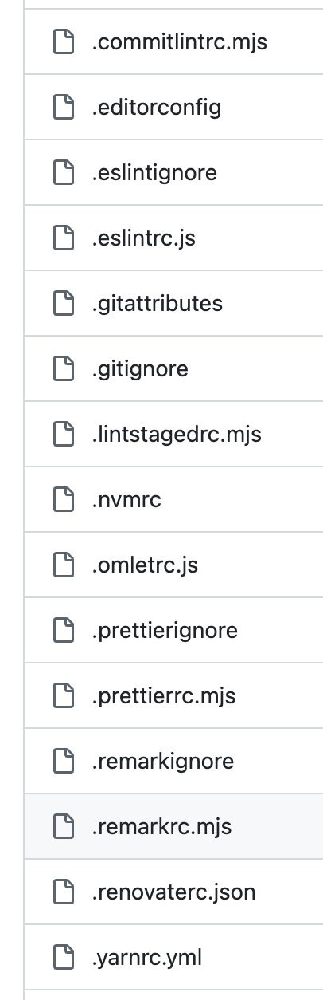
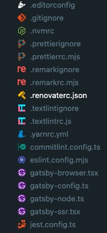

If you've worked on JavaScript projects recently, you've probably noticed
something: configuration files are changing. The familiar `.eslintrc.js` and
`.babelrc` files are being replaced by `eslint.config.js` and similar
`*.config.js` naming patterns. This isn't just a cosmetic change - it represents
a fundamental shift in how the JavaScript ecosystem handles configuration.

## What Are the RC Files?

Before diving into what's changing, let's clarify what we're moving away from.
The **rc** in `.eslintrc` stands for **run commands** or **runtime
configuration**. These dotfiles—marked by the leading period—have been the
standard way to configure software applications for decades.



If you're a macOS or Linux user, you're probably familiar with dotfiles. I've
always been a fan of this convention. That leading dot serves a practical
purpose: all configuration files are automatically grouped together at the top
of any file explorer, whether in your IDE or a repository view. You know
immediately that you're looking at configuration files.

## Why JavaScript Config Files?

Before we discuss the naming shift, it's worth noting why JavaScript-based
config files became popular in the first place. As a frontend engineer, I prefer
using .js or .ts extensions for configuration files. Here's why:

### Comments and documentation

JSON files don't support comments, which makes them harder to maintain. When you
need to explain a tricky configuration setting or link to documentation,
comments are invaluable. This is also why I avoid placing configuration inside
`package.json` — the lack of comments makes it harder to read.

### Logic and flexibility

Configuration files are often declarative, but JavaScript allows you to add
conditional logic, compute values, or import shared settings when needed. This
flexibility becomes important as projects grow in complexity.

### Familiarity

It's simply the language we use most. Why context-switch to YAML or TOML when
JavaScript works perfectly well?

## The Move Towards `*.config.js`

So if JavaScript-based config files were already common, why the shift from
`.eslintrc.js` to `eslint.config.js`? The answer lies in the JavaScript
ecosystem's broader evolution toward ESM (ECMAScript Modules) and
standardization.

### Better Support for Modern JavaScript

A `.js` config file can use `import/export` or `require` directly, just like any
other JavaScript code. This is far simpler than parsing JSON or YAML, or
implementing custom file resolution.

For example, ESLint's flat config system lets you import shareable configs or
plugins directly in `eslint.config.js`:

```js
import js from '@eslint/js';
import typescriptParser from '@typescript-eslint/parser';

export default [
  js.configs.recommended,
  {
    files: ['**/*.ts'],
    languageOptions: {
      parser: typescriptParser,
    },
  },
];
```

In Node's ESM world, file extensions must be explicitly specified. Naming the
file `*.config.js` (or `.mjs`/`.cjs`) makes this explicit and straightforward.
ESLint's flat config, for instance, requires the `.js` extension even in module
projects.

### Eliminating Config Cascades

Moving to a single `<tool>.config.js` file eliminates the complex cascading
behavior of nested `.rc` files. ESLint explicitly adopted a flat configuration
to avoid dealing with multiple configuration files in different directories,
each with its own merging rules and precedence.

Having one root config file means fewer moving parts. As the ESLint team puts
it: one location, one format, one predictable behavior.

### Community Standards and Tooling

Many config-resolving libraries, like cosmiconfig, default to looking for
`<name>.config.js` files. For example, cosmiconfig automatically checks for
`myapp.config.js` (plus `.mjs`, `.cjs`, and other variants) when your package is
named "myapp."

This means tools that use cosmiconfig — including Prettier, Stylelint, and many
others — will load either `.rc` or `.config.js` files. Over time, the
`.config.js` convention has become the community standard. It's supported by
default in config lookup libraries, and major tools are actively moving toward
it.

### Ecosystem Convergence

The change isn't mandated by a single library — it's a community-wide trend
driven by technical benefits:

- **ESLint 9** uses flat config exclusively with `eslint.config.js`
- **Stylelint**'s documentation recommends `stylelint.config.js` and warns that
  old `.stylelintrc` files are deprecated
- **Vite**, **Vitest**, **and other modern tools** default to `*.config.js`
  naming

The ecosystem is converging on `*.config.js` for clarity, performance, and ease
of use.

## Dealing with Naming Inconsistencies

The trend is clear, but it will take time until all tools fully adopt ESM or
support only native Node configuration loading. During this transition period,
you might end up with a mix of naming conventions in your project.



Fortunately, there's a straightforward solution. Almost all tools support a CLI
config path argument like `--config`:

```sh
eslint --config .eslintrc.js src/
prettier --config .prettierrc.js --write .
```

Using this option, you can name your configuration files consistently and place
them wherever you want. You can maintain your preferred naming convention across
all tools in your project.

The downside is that this requires extra effort. You'll need to update your npm
scripts and CI configuration to include these flags. It doesn't work out of the
box.

## Making the Migration

If you're considering migrating from RC files to the new convention, here are
some practical tips:

**Start with new tools.** When adopting new tools, use the `*.config.js`
convention from the start. This establishes the pattern for your project.

**Migrate gradually.** You don't need to update all config files at once.
Migrate tool by tool as you upgrade or modify configurations.

**Update documentation.** Make sure your team knows which convention you're
using and update any setup guides or README files accordingly.

**Leverage migration guides.** Tools like ESLint provide detailed migration
guides. ESLint's flat config migration tool can even automate parts of the
conversion.

## Conclusion

I'll continue using JavaScript and TypeScript for configuration files — the
benefits of comments, logic, and familiarity are too valuable to give up. As for
naming conventions, I'm moving to `*.config.js` for the sake of consistency and
alignment with where the ecosystem is heading.

Yes, I'll miss the elegant simplicity of dotfiles automatically grouping
together in my file explorer. But the technical benefits — native ESM support,
simpler resolution, elimination of cascading configs — make this shift
worthwhile.

The JavaScript ecosystem is maturing, and configuration is just one area where
we're seeing standardization and improved tooling. This change represents
progress, even if it means letting go of some old favorites.

## References

- [RC Config Files][rc-config-files] - What are RC Config Files?
- [cosmiconfig][cosmiconfig] - JavaScript library for finding and loading
  configuration files
- [ESLint Config][eslint-config] - New Config System Part 2
- [Prettier Config][prettier-config] - Configuration File
- [Stylelint Config][stylelint-config] - Configuration Object
- 📷 [Caspar Camille Rubin][photographer-caspar-rubin] - [PS4
  Controller][ps4-controller]

## Further Reading

- [Ultimate Guide to Dotfiles][ultimate-guide-to-dotfiles]

[cosmiconfig]: https://github.com/cosmiconfig/cosmiconfig
[eslint-config]:
  https://eslint.org/blog/2022/08/new-config-system-part-2/#:~:text=In%20contrast%20to%20eslintrc%2C%20which,custom%20parsing%20of%20config%20files
[photographer-caspar-rubin]: https://unsplash.com/@casparrubin
[prettier-config]: https://prettier.io/docs/configuration#:~:text=,package.json
[ps4-controller]:
  https://unsplash.com/photos/closeup-of-white-sony-ps4-controller-HUBNTCzE-R8
[rc-config-files]: https://medium.com/@aadishazzam/rc-files-403a2b7c80a9
[stylelint-config]:
  https://stylelint.io/user-guide/configure/#:~:text=Stylelint%20expects%20a%20configuration%20object
[ultimate-guide-to-dotfiles]:
  https://www.daytona.io/dotfiles/ultimate-guide-to-dotfiles
