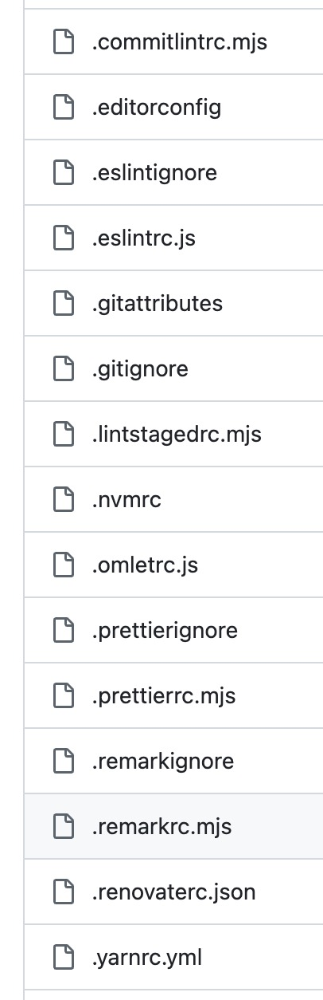

First of all, I must admit that I am a big fan of the "legacy" configuration
files like `.eslintrc.js`, `.prettierrc.js`, or `.babelrc.js`. They are the
"dotfiles" – denoted with a `.` (dot) – and if you are a macOS or Linux user
like me, you are probably familiar with them.

I love them because of that dot at the beginning of the filename. All
configuration files using this naming convention are sorted together in the file
explorer of any kind, whether it's an IDE or a repository view.

## What Are the RC Files?

The "rc" here stands for "run commands" or "runtime configuration". These files
serve as configuration files that are used to customize the behavior of software
applications.

This makes them easy to spot, and you know immediately that you're looking at a
configuration file.

Secondly, I should mention that I'm not covering all the other file extensions
that configuration files can have – like `.eslintrc.json`, `.babelrc`, or
`.prettierrc.toml`. The reason is not as obvious as in the case of using a
simple dot. As a frontend engineer, I prefer using JavaScript or TypeScript file
extensions like `.js` or `.ts` for configuration files too. It's the language I
use the most, after all. And besides, some other file formats don't support
comments, like JSON. This is the same reason why I don't place my configuration
inside the `package.json` file. A lack of comments makes configuration files
less readable and maintainable. And from time to time, you need to explain a
configuration setting or link to some documentation. Last but not least, since
most configuration file formats are just declarative, they cannot support any
logic.

So, if using configuration files as plain JavaScript is already possible, why
the shift to `*.config.js`?

## The Move Towards ESM

For the past few years, the Node.js ecosystem has been moving towards
unification under the ESM (ECMAScript Modules) standard. And maybe also towards
better support for types, as TypeScript is getting more and more popular.

This shift is evident everywhere, including in how we use configuration files.

There are several reasons that drove this trend:

### Native Node Loading and ESM/TS Support

A `.js` config file can use `import`/`export` or `require` directly, just like
any JS code. This is much simpler than parsing JSON/YAML or implementing custom
resolution. For example, ESLint's flat config lets you import shareable configs
or plugins directly in `eslint.config.js`. In Node's ESM world, file extensions
are explicit, so naming the file `*.config.js` (or `.mjs`/`.cjs`) is
straightforward. (Indeed, ESLint flat config requires the `.js` extension even
in module projects.)

### Single-File Config vs. Cascade

Moving to a single `<tool>.config.js` eliminates complex cascades of nested
`.rc` files. ESLint explicitly moved to flat config to avoid multiple config
files in different directories, merging, etc. Having one root config means fewer
moving parts – as ESLint puts it, one location and one format.

### Community Conventions and Tooling

Many config-resolving libraries (like cosmiconfig) by default look for
`<name>.config.js` files. For instance, cosmiconfig checks for `myapp.config.js`
(plus `.mjs`, `.cjs`, etc.) by default when your package is named "myapp". In
practice, this means tools that use cosmiconfig (Prettier, Stylelint, etc.) will
happily load either `.rc` or `*.config.js`. Over time, the `.config.js`
convention has simply become common – it's supported by default in config lookup
libraries.

Overall, the change is a community trend driven by technical benefits, not a
single mandated library. ESLint, Stylelint, and others have documented their
moves: ESLint 9's flat config exclusively uses `eslint.config.js`, and
Stylelint's docs advise creating `stylelint.config.js` and warn that old
`.stylelintrc` files are deprecated.

These sources make it clear the ecosystem is converging on `<name>.config.js`
for clarity, performance, and ease of use.

## Naming Conventions Mismatch

Although the trend is clear, it will take some time until all tools adopt ESM
fully or support only native Node configuration loading. So whether you prefer
using `.config.js` or you want to stick with the legacy "dotfiles" naming like
`.*rc.js`, you will probably face some file naming convention mismatches.

But there is a simple solution for that. Almost all tools support some kind of
CLI config path argument like `--config`. Using this simple option, you can name
your configuration file as you wish and place it where you want, and thus
maintain consistency across your project's configuration.

The downside is that this approach requires some extra effort and doesn't work
out of the box 🤷‍♂️.

## Conclusion

I will definitely stick with the JavaScript/TypeScript configuration file
format. And for the sake of configuration file naming sanity, I will probably
move to the `*.config.js` naming convention. However, there's still a debate
about whether to sacrifice auto-discoverability of configuration files for the
sake of consistency and readability.

## References

- [RC Config Files][rc-config-files] - What are RC Config Files?
- [Cosmiconfig][cosmicconfig] - JavaScript library for finding and loading
  configuration files
- [ESLint Config][eslint-config] - New Config System Part 2
- [Prettier Config][prettier-config] - Configuration File
- [Stylelint Config][stylelint-config] - Configuration Object
- 📷 [Caspar Camille Rubin][photographer-caspar-rubin] - [PS4
  Controller][ps4-controller]

## Further Reading

- [Ultimate Guide to Dotfiles][ultimate-guide-to-dotfiles]

[cosmicconfig]: https://github.com/cosmiconfig/cosmiconfig
[eslint-config]:
  https://eslint.org/blog/2022/08/new-config-system-part-2/#:~:text=In%20contrast%20to%20eslintrc%2C%20which,custom%20parsing%20of%20config%20files
[photographer-caspar-rubin]: https://unsplash.com/@casparrubin
[prettier-config]: https://prettier.io/docs/configuration#:~:text=,package.json
[ps4-controller]:
  https://unsplash.com/photos/closeup-of-white-sony-ps4-controller-HUBNTCzE-R8
[rc-config-files]: https://medium.com/@aadishazzam/rc-files-403a2b7c80a9
[stylelint-config]:
  https://stylelint.io/user-guide/configure/#:~:text=Stylelint%20expects%20a%20configuration%20object
[ultimate-guide-to-dotfiles]:
  https://www.daytona.io/dotfiles/ultimate-guide-to-dotfiles
