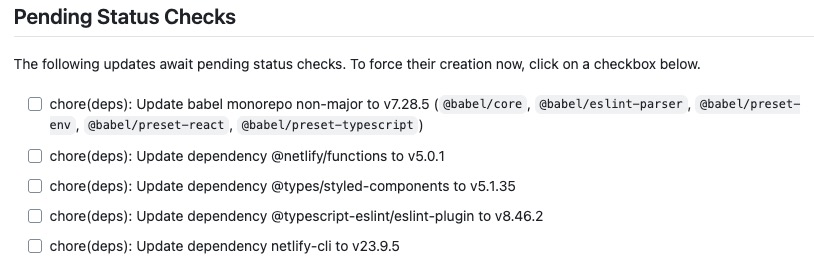

During last few weeks the JavaScript ecosystem, especially the part using npm
packages, was hit hard by a series of supply-chain attacks. In this post I would
like to share some of the tips and best practices that can help you to
strengthen the security and safety of your packages and libraries while
installing and upgrading packages from npm registry.

My package manager of choice is Yarn, so most of the examples will be using
Yarn, however similar approaches are also applicable to npm or pnpm as well.

## Avoid blind dependency upgrades

As a first line of defense I have started using automated tooling for managing
dependencies a long time ago. The tools like Dependabot or Renovate can help you
to keep your dependencies up to date and also alert your about potential
security vulnerabilities in your dependencies.

My weapon of choice in this case is Renovate. Shortly, because it is highly
configurable and thus it can be adjusted to your specific needs. You can read
more about my experience with this tool in my previous post [Renovate your
dependencies: Automated dependency management for modern
applications][renovate-your-dependencies].

Some developers automatically upgrade all dependencies to the latest versions as
part of continuous integration processes or local development practices, aiming
to ensure forward compatibility or stay at "bleeding edge". Blind dependency
upgrades can pull in malicious packages from compromised accounts, introduce
functional bugs, or expose applications to supply chain attacks

Blindly upgrading all dependencies to their latest versions can expose your
application to security vulnerabilities, dependency confusion attacks, and
malicious packages released from compromised accounts.

### How to implement?

Use controlled dependency manangement:

```sh
yarn dlx npm-check-updates --interactive
```

For DependaBot you can introduce a configuration file `.github/dependabot.yml`
in your repository:

```yaml
version: 2
updates:
  - package-ecosystem: 'npm'
    directory: '/'
    schedule:
      interval: 'daily'
    open-pull-requests-limit: 5
    commit-message:
      prefix: 'deps'
```

👉 Read more in [Dependabot documentation][dependabot-docs]

For Renovate you can introduce a configuration file `.renovaterc.json` in your
repository:

```json
{
  "extends": ["config:base"],
  "schedule": ["before 5am on monday"]
}
```

👉 Read more in [Renovate documentation][renovate-docs]
👉 Use [Snyk Automated Dependency Update PRs][snyk-prs]

## Disable Postinstall Scripts

The most recent attacks known as "Shai-hulud" and "Nx" have leveraged the
`postinstall` scripts to execute malicious code on the developer's machine
during package installation. They all tried to exfiltrate sensitive data,
trigger a worm-like propagation and perform other malicious activities.

By disabling post-install scripts, you can mitigate the risk of such attacks by
preventing the execution of potentially harmful code during the installation
process.

### How to implement?

It is highly recommended to disable postinstall scripts for each project. To
disable them you can set [Yarn's configuration
option][yarn-config-enable-scripts] `enableScripts` to `false`:

```sh
yarn config set enableScripts false
```

Or you can disable them using configuration option in `.yarnrc.yml` file:

```yaml
# .yarnrc.yml

# Do not run postinstall scripts from 3rd party packages
# @see: https://pnpm.io/supply-chain-security
# @see: https://yarnpkg.com/configuration/yarnrc#enableScripts
enableScripts: false
```

### Enable only scripts you need

Some of the install scripts are there for a reason. If you need to run them, do
it in an auditable way and avoid npm trusting the package name in package.json
too much.

Using Yarn's `dependenciesMeta` configuration option, you can enable postinstall
scripts by listing specific packages for which you want to allow script
execution.

```yaml
enableScripts: false

dependenciesMeta:
  husky:
    scripts:
      postinstall: true
```

Or you can use 3rd party tool [allow-scripts][lavamoat-allow-scripts] to create
an allowlist of specific positions in your dependency graph where scripts are
allowed.

Note: For additional details and other package managers refer to [Awesome npm
Security: Disable Post-install Scripts][disable-postinstall-scripts]

## Install with Cooldown Period

Some of newly released packages may contain a malicious code. Attacker always
expects there will be some delay before the attack is discovered by the
community and reported. Sometime this is a matter of hours, sometimes days,
until the package is unpublished or patched.

Attackers build on the npm versioning and publishing model which prefers and
resolves to lates semver ranges by default. So they trying to deploy the new or
most recent version of the package with the malicious code.

To mitigate this risk, you can introduce a "cooldown" period before installing
or upgrading any package to its latest version. This way you reduce the chance
of installing compromised packages. In the time of the delay, the packages can
be still quickly discovered by community and removed from the registry.

### How to implement?

Configure your package manager or automated dependency management tools to delay
installations of recently published packages, allowing time for community to
discover and report potential security issues or functional problems.

Use Yarn's `npmMinimalAgeGate` configuration option to set a cooldown period (in
minutes) for newly published packages. For example, setting it to 10080 minutes
(7 days) will prevent the installation of packages that were published less than
7 days ago.

```yaml
# reduce the likelihood of installing compromised packages
# @see: https://yarnpkg.com/configuration/yarnrc#npmMinimalAgeGate
npmMinimalAgeGate: 10080 # 7 days in minutes; 60 * 24 * 7
```

Be aware that when setting this option, Yarn will not inform you clearly about
blocking the installation of the new package because of the age gate. Instead,
the installation will silently fail in a manner that the package and version you
want to install is not found.

```sh
➤ YN0000: · Yarn 4.10.3
➤ YN0000: ┌ Resolution step
➤ YN0082: │ vite@npm:6.4.1: No candidates found
➤ YN0000: └ Completed in 0s 327ms
➤ YN0000: · Failed with errors in 0s 337ms
```

If you think about this in depth, it however make sense since we are setting
some additional resolution constraints. So in that way Yarn did not found any
package that matched the setted criteria. Even if the package exists in the
registry, but the version is simply not old enough to pass through the age gate.

#### Dependabot automated dependency upgrades with cooldown period

Dependabot has a [`cooldown`][dependabot-cooldown] configuration option, for
setting the number of days before a specific version of a dependency will be
updated:

```yaml
version: 2
updates:
  - package-ecosystem: 'pip'
    directory: '/'
    schedule:
      interval: 'daily'
    cooldown:
      default-days: 5
      semver-major-days: 30
      semver-minor-days: 7
      semver-patch-days: 3
      include:
        - 'requests'
        - 'numpy'
        - 'pandas*'
        - 'django'
      exclude:
        - 'pandas'
```

> Defines a **cooldown** period for dependency updates, allowing updates to be
> delayed for a configurable number of days.

👉 Read more in [Dependabot documentation][dependabot-pr-cooldown]

#### Renovate automated dependency upgrades with minimumReleaseAge

Renovate bot has a [`minimumReleaseAge`][renovate-minimumreleaseage] config
option, for setting the minimum age of each package version before a pull
request will be created for it:

```json
{
  "extends": ["config:base"],
  // Security and Stability: Wait at least 7 days before updating any new version
  // Delay the supply chain attack impact by waiting
  // @see: https://docs.renovatebot.com/configuration-options/#minimumreleaseage
  "minimumReleaseAge": "7 days"
}
```

> Time required before a new release is considered stable.

Renovate will not create pull requests for package versions until they pass the
minimum release age.



If you force the Renovate bot to create a pull request for a version that has
not yet met the minimum release age, the pull request will be still marked as
pending with a GitHub Action status check:


## Use immutable installations

Using just `yarn` or `yarn install` command without any additional flags in
production can lead to inconsistent installations when lockfiles and
`package.json` are out of sync, potentially introducing unintended package
versions and security vulnerabilities that resolves during installation time.

Package managers like npm and Yarn compensate for inconsistencies between
`package.json` and lockfiles by installing different versions then those
recorded in the lockfile. This behavior can be hazardeos for build and
production environments as they could pull in unintended package versions,
rendering the entire benefit of lockfile determinism futile. Developer should
also favor deterministic package resolution and methods in their local
workflows.

### How to implement?

To ensure consistent and secure installations, always use the `--immutable` flag
with Yarn:

```sh
yarn install --immutable
```

or use `--frozen-lockfile` if you are using Yarn Classic (v1):

```sh
yarn install --frozen-lockfile
```

Additionally to prevent local Yarn install's to unintentionally adjust the
`yarn.lock`, you can use `enableImmutableInstalls` option in your `.yarnrc.yml`
file:

```yaml
# Define whether to allow adding/removing entries from the lockfile or not.
# @see: https://yarnpkg.com/configuration/yarnrc#enableImmutableInstalls
enableImmutableInstalls: true
```

Furthermore, in cases were Yarn cache already exists (e.g. crons on the server)
then you can disable any modification of the cache during the installation:

```sh
yarn install --immutable --immutable-cache
```

## Prevent lockfile injection

JavaScript package managers allow users to install packages from unconventional
sources such as GitHub Gists or directly from source code repositories.
Attackers can exploit this feature by updating the lockfile to specify a new
source location (in the `resolved` key) that they control, and set the SHA512
integrity value accordingly to avoid detection.

The security thread occurs when the malicious actors gain ability to contribute
source code changes via mechanism such as pull requests.

You can use tool like lockfile-lint to validate that your lockfiles adhere to
security policies.

### How to implement?

Install lockfile-lint to validate your lockfiles:

```sh
yarn add -D lockfile-lint
```

Validate `yarn.lock` with multiple allowed sources:

```sh
yarn dlx lockfile-lint --path yarn.lock --type yarn --allowed-hosts npm yarn --validate-https
```

### CI/CD Integration

Integrate lockfile-lint into your development workflow, such as the following
`lint:lockfile` script in `package.json` that runs before every install:

```json
{
  "scripts": {
    "lint:lockfile": "lockfile-lint",
    "preinstall": "yarn lint:lockfile"
  }
}
```

in combination with configuration object in `lockfile-lint.config.ts` file:

```typescript
export default {
  'allowed-hosts': ['npm', 'yarn'],
  path: 'yarn.lock',
};
```

## Consider version pinning

## Package Auditing and Scanning

You should never install npm packages blindly without properly auditing their
package health and security signals.

How do you know if a npm package is safe to install? Maybe it was Just published
yesterday? Maybe you have and accidental typo in the package name and land on a
simillary named malicious package? And so on.

Installing a new ad-hoc npm package can expose your system to supply chain
attacks, malware, and other security risks. Many attacks compromised trusted and
popular npm packages, exploit typosquatting, or introduce malicious code in
pre/post-install scripts that execute during the installation process.

### How to implement?

Both npm and Yarn provide built-in auditing capabilities through the `npm audit`
command to scan for known vulnerabilities in your dependencies.

Audit your dependencies using npm:

```sh
npm audit
```

Or using Yarn:

```sh
yarn npm  audit
```

However, both commands validates already installed packages. To audit packages
before installation you can use other third-party tools like [npq][npq] or
[sfw][sfw].

While `sfq` (Socket Firewall) focus on creating a secure sandbox environment to
safely install and audit npm packages, `npq` (Node Package Quality) provides a
proactive security control that audits npm packages before installation,
providing comprehensive security checks, package health signals, and interactive
warnings for potentially dangerous or high-risk packages.

You can install both package globally:

```bash
npm install -g npq

# or

npm install -g sfw
```

and then use them to audit packages before installation:

```bash
npq install express

# or

sfw yarn add express
```

## Enable 2FA for npm accounts

npm accounts without two-factor authentication are vulnerable to credential
theft and account takeover attacks, potentially allowing malicious actors to
publish compromised versions of your packages. Two-factor authentication
provides essential protection against such attacks by requiring additional
verification beyond just username and password.

### How to implement?

Enable two-factor authentication on all npm accounts, especially for package
maintainers, to prevent unauthorized access and malicious package publications.

Enable 2FA for authentication and publishing:

```sh
npm profile enable-2fa auth-and-writes
```

For login and profile changes only:

```sh
npm profile enable-2fa auth-only
```

## Publish with provenance attestation

Provenance statements provide cryptographic proof of where and how your packages
were built, establishing a verifiable link between your source code and
published packages. This transparency helps users verify package authenticity
and detect tampering.

### How to implement?

Publish with provenance in GitHub Actions:

```yaml
permissions:
  id-token: write
steps:
  - run: npm publish --provenance
  # or alternatively using Yarn
  - run: yarn npm publish --provenance
```

Use Yarn's `npmPublishProvenance` configuration option in your `.yarnrc.yml`
file:

```yaml
# Enable provenance publishing for npm packages
# @see: https://yarnpkg.com/configuration/yarnrc#npmPublishProvenance
npmPublishProvenance: true
```

For monorepos using `lerna` the provenance publishing is supported from version
v6.6.2 using:

- `NPM_CONFIG_PROVENANCE=true` environment variable
- `provenance=true` in `.npmrc`
- `publishConfig` in `package.json`

```json
{
  "publishConfig": {
    "provenance": true
  }
}
```

👉 Read more about [provenance publishing][provenance-publishing]

## Publish using trusted publishers

Long-lived npm tokens can be compromised, accidentally exposed in logs, or
provide persistent unauthorized access if stolen, posing significant security
risks to your packages.

Trusted publishing eliminates the need for long-lived npm tokens by using OpenID
Connect (OIDC) authentication from your CI/CD environment. This approach uses
short-lived, cryptographically-signed tokens that are specific to your workflow
and cannot be extracted or reused. This npm package release method is tightly
scoped to only allow publishing from your trusted CI environment (GitHub Actions
or GitLab) and your specifically authorized workflow files.

### How to implement?

Configure trusted publishing on npmjs.com for your package and update your
CI/CD:

GitHub Actions:

```yaml
permissions:
  id-token: write
steps:
  - run: yarn publish
```

Trusted publishing supports GitHub Actions and GitLab CI/CD, and automatically
generates provenance attestations which complies with OpenSSF standards.

👉 Trusted publishing is generally available on GitHub
https://github.blog/changelog/2025-07-31-npm-trusted-publishing-with-oidc-is-generally-available/
👉 Read more about trusted publishing on npmjs.com
https://docs.npmjs.com/trusted-publishers

For monorepo developers the [trusted publishing][lerna-oidc-publishing] is
supported in `lerna` [from version 9.0.0][lerna-trusted-publishing].

## Reduce package dependency tree

Each dependency in your package increases the attack surface and potential for
supply chain vulnerabilities, as users inherit all transitive dependencies when
installing your package.

Minimizing dependencies reduces security risks, improves performance, and
decreases the likelihood of supply chain attacks. Fewer dependencies mean fewer
potential points of failure and reduced exposure to malicious packages in the
dependency tree.

However this does not mean you should avoid using dependencies altogether or
reimplement every functionality from scratch instead of using a well maintained
library.

The key is to find balance and be intentional about dependency choices. Design
packages with minimal or zero dependencies when possible, by leveraging modern
JavaScript features and built-in APIs or using of standard library capabilities
instead of external packages.

Sometime is better to implement and maintain small utility code in your own
codebase even if you know there are lots of existing libraries that can do the
same.

### How to implement?

Replace common dependencies with native JavaScript:

```js
// Instead of lodash
const unique = [...new Set(array)];

// Instead of axios for simple requests
const response = await fetch(url);

// Instead of utility libraries
const isEmpty = (obj) => Object.keys(obj).length === 0;
```

Modern JavaScript provides many built-in capabilities that previously required
external libraries. Consider the maintenance burden, security implications, and
bundle size impact before adding any dependency.

## Work in isolated environments

Running npm packages directly on your host development machine exposes your
entire system to potential malware, allowing malicious packages to access
sensitive files, spawning agentic coding CLIs, agent environment variables, and
system resources.

By leveraging containerization technologies and approaches like Docker or dev
containers, you can create isolated, sandboxed environments that limit the
potential impact of supply chain attacks. When malicious npm packages execute
during installation or runtime, they are confined to the container environment
rather than having access to your entire host system where you may have running
other projects, sensitive files, or personal data.

### How to implement?

Use Docker to create isolated development environments:

```Dockerfile
FROM node:20
WORKDIR /app
COPY package.json yarn.lock ./
RUN yarn install --immutable
COPY . .
CMD ["yarn", "start"]
```

Use Dev Containers for Visual Studio Code[^1]:

```json
// .devcontainer/devcontainer.json
{
  "name": "Node.js Dev Container",
  "image": "mcr.microsoft.com/vscode/devcontainers/javascript-node:20",
  "workspaceFolder": "/workspace",
  "postCreateCommand": "yarn install --immutable"
}
```

> [!NOTE]
> Using isolated environments not only enhances security by containing potential

> [!TIP]
> Using isolated environments not only enhances security by containing potential

## References

- [Awesome npm Security Best Practices][npm-security-best-practices]
-

[^1]: My reference

[npm-security-best-practices]:
  https://github.com/lirantal/npm-security-best-practices
[renovate-your-dependencies]:
  https://literat.dev/blog/2021-03-05/renovate-your-dependencies/
[npm-ignore-scripts]:
  https://www.nodejs-security.com/blog/npm-ignore-scripts-best-practices-as-security-mitigation-for-malicious-packages
[yarn-config-enable-scripts]:
  https://yarnpkg.com/configuration/yarnrc#enableScripts
[lavamoat-allow-scripts]: https://www.npmjs.com/package/@lavamoat/allow-scripts
[disable-postinstall-scripts]:
  https://github.com/lirantal/npm-security-best-practices?tab=readme-ov-file#1-disable-post-install-scripts
[dependabot-docs]: https://docs.github.com/en/code-security/dependabot
[renovate-docs]: https://docs.renovatebot.com/getting-started/use-cases/
[dependabot-pr-cooldown]:
  https://docs.github.com/en/code-security/dependabot/dependabot-version-updates/optimizing-pr-creation-version-updates#setting-up-a-cooldown-period-for-dependency-updates
[dependabot-cooldown]:
  https://docs.github.com/en/code-security/dependabot/working-with-dependabot/dependabot-options-reference#cooldown-
[renovate-minimumreleaseage]:
  https://docs.renovatebot.com/configuration-options/#minimumreleaseage
[sfw]: https://socket.dev/blog/introducing-socket-firewall
[npq]: https://github.com/lirantal/npq
[provenance-publishing]: https://docs.npmjs.com/generating-provenance-statements
[lerna-trusted-publishing]:
  https://github.com/lerna/lerna/issues/4219#issuecomment-3319632280
[lerna-oidc-publishing]:
  https://lerna.js.org/docs/recipes/oidc-trusted-publishing
[snyk-prs]: https://docs.snyk.io/scan-with-snyk/pull-requests/snyk-pull-or-merge-requests/upgrade-dependencies-with-automatic-prs-upgrade-prs/upgrade-open-source-dependencies-with-automatic-prs
