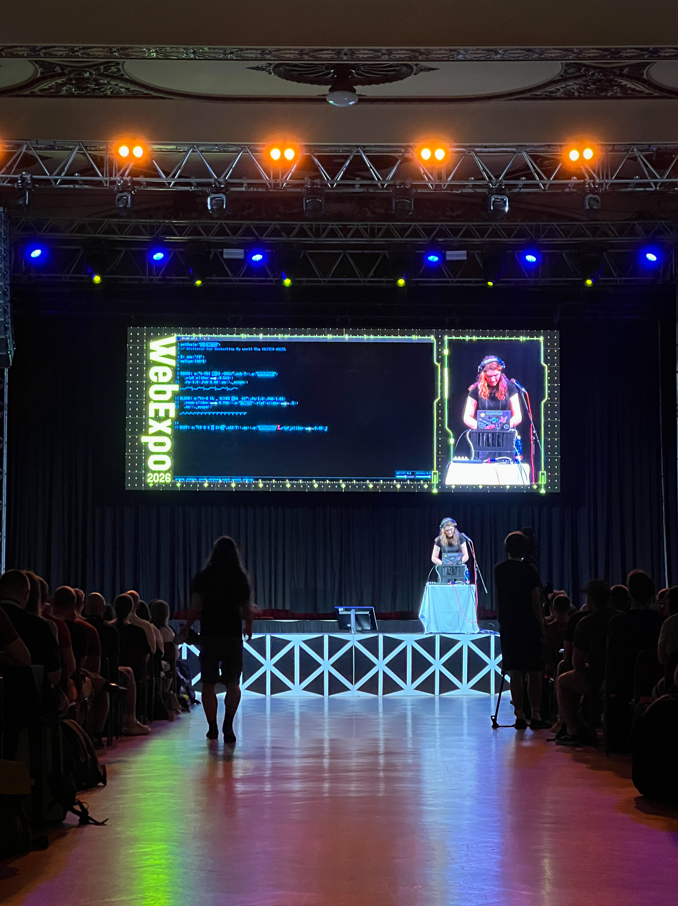
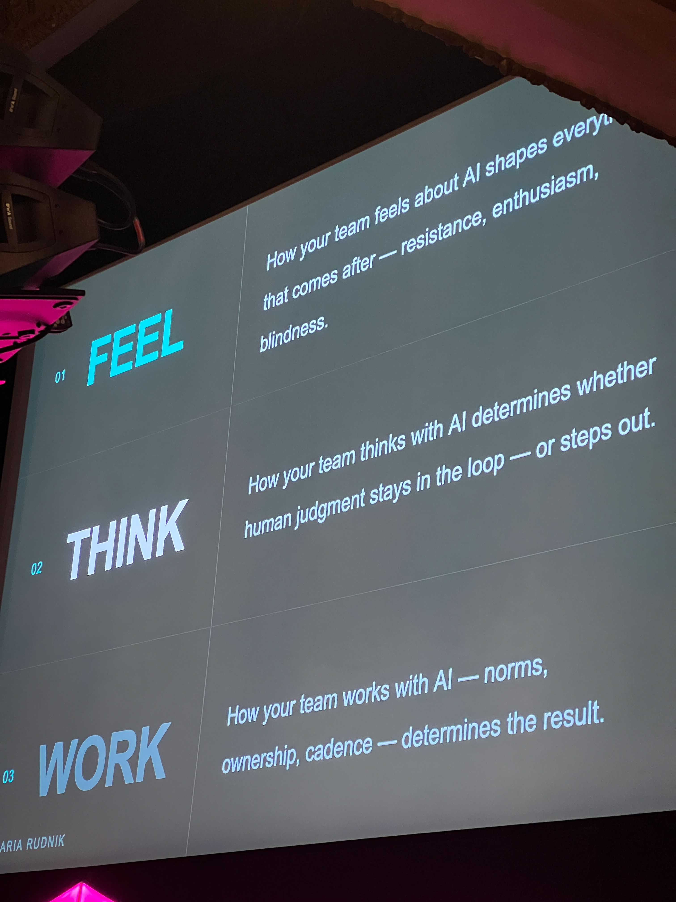
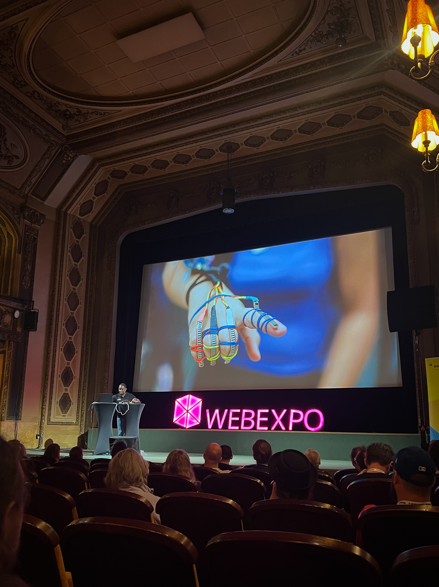
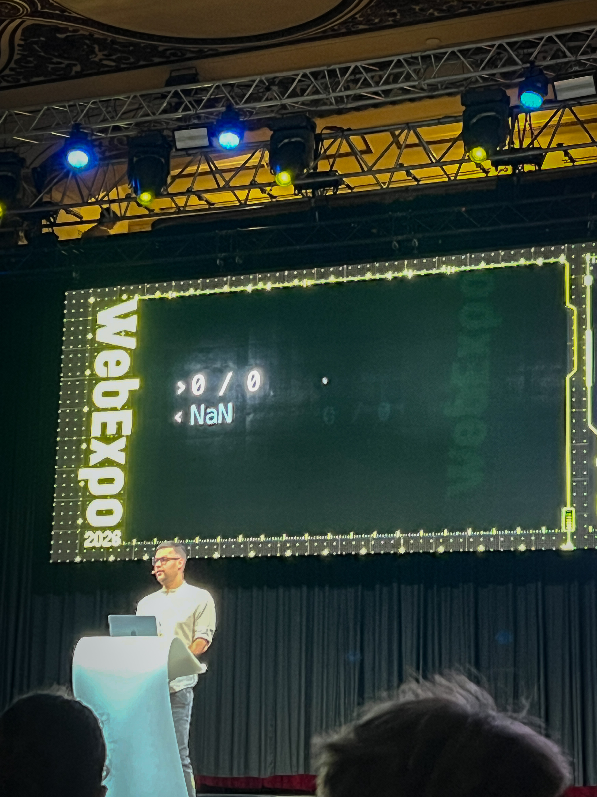
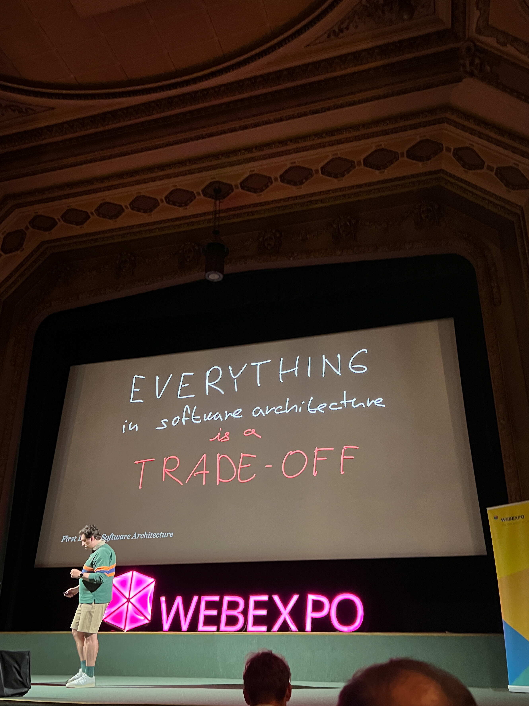
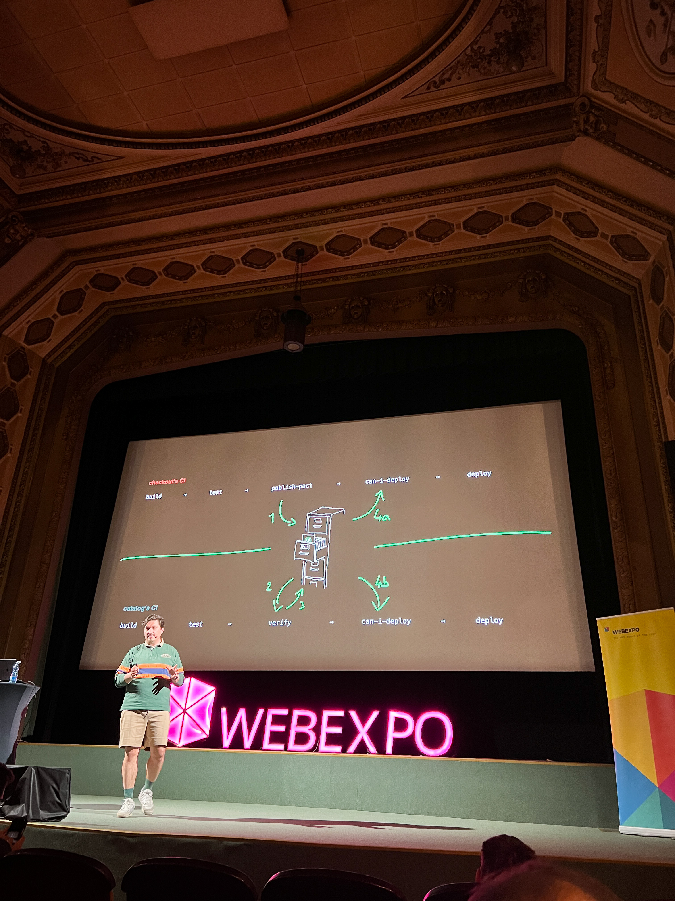
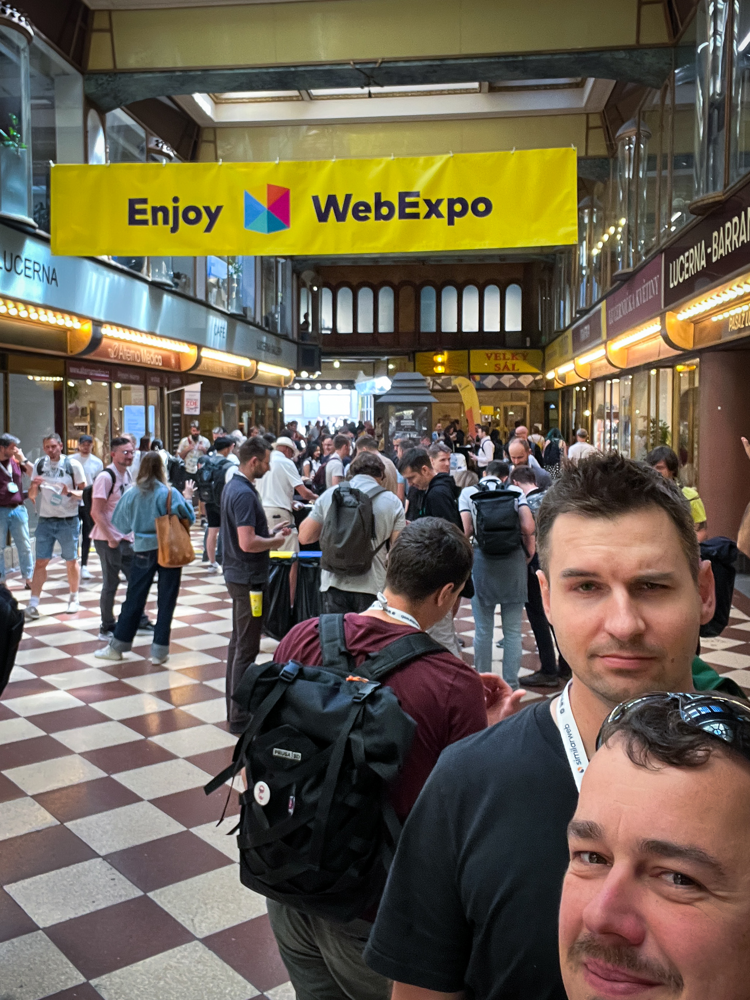
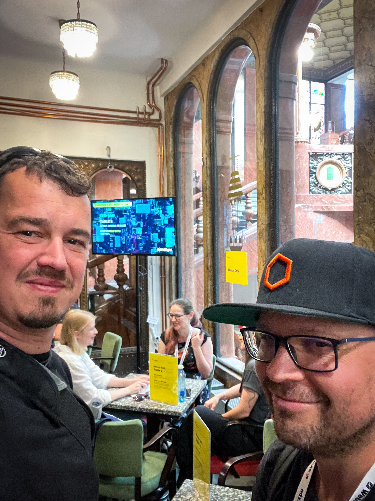

import { Gallery } from '../../components/mdx/Gallery';

## Design Systems & UI

> We are building our Spirit Design System well enough. Most of the talks were
> just a reminder that we are on the right track. But If I can pick one
> highlight, definitely check your **Typography.**

**[A real story: Dropping MUI for clean CSS][dropping-mui-for-clean-css]** -
Kate Astrid

- community driven UI library can be a burden
- clean CSS is far more powerful and flexible than ever
- dropping MUI can enhance performance and the user experience, if we replace it
  carefully

**[Select it! Styling new HTML UI
capabilities][select-it-styling-new-html-ui-capabilities]** - Brech De Ruyte

- styling a native HTML `select` element
- capabilities of the future CSS and browser support

**[Why adding 45th theme to your product won't be a
problem][why-adding-45th-theme]** - Anastasia Gartseva

- about how to setup your design tokens structure so adding multiple themes
  won't be a problem
- core, semantic and component tokens

**[Design systems that scale smart: Building systems that grow with your teams,
tools, and products][design-systems-that-scale-smart]** - Johannes Lehner

**[How bad typography kills UX][how-bad-typography-kills-ux]** - Oliver
Schonderfer

- 4 stories about bad typography and how it can kill the user experience
- example on IKEA and multi language and multi device support across the world
- example on Apple and liquid glass and how contrast is killing
- example on Oscars and how badly structured hierarchy can switch the winners
  and losers
- example on Pope's tomb and usage of kerning and letter spacing
- a theatrical and engaging talk, but also informative and full of examples
- [Pimp My Type][pimpmytype]

Now I understand why finding good typography for this website is so hard. 🤔

## Accessibility

> Accessibility matters! More than you can imagine.

**[What I wish someone told me when I first started using
ARIA][what-i-wish-someone-told-me-aria]** - Eric Bailey

- how ARIA attributes actually work
- main ARIA principles and how to use them correctly
- also breaking some myths around the ARIA

**[Designing for everyone: How we build accessibility into our design
system][designing-for-everyone]** - Peter Leško

- how Tatra Bank builds the accessibility into their design system
- throughout the questionnaires, workshops and testing with the users
- accessibility documentation, examples and guidelines for the designers and
  developers
- going through some examples of accessibility issues and how to solve them

## AI & Future of development

> AI is everywhere, but I did not hear anything strongly new or surprising.

**[Design like no-one is watching][design-like-noone-is-watching]** - Mike Kus

- AI will not replace designers, because it can't replace creativity, it is
  still a statistical model
- notably, the slides were hand-crafted in Photoshop and Figma on purpose — no
  AI
- examples of built designs and websites
- the best part is the end how he created all those slides in Photoshop, hand
  drawing and Figma

**[Partnering with AI: Building future-ready
teams][partnering-with-ai-building-futureready-teams]** - Daria Rudnik

- custom framework for driving the AI adoption and teams

**[Fossils, Rockets, and Octopuses: A leadership framework for AI
adoption][fossils-rockets-and-octopuses]** - Senta Čermáková

- another custom framework for AI adoption
- sorting people into animal categories by their attitude towards AI and how to
  deal with them

**[How to prevent AI Agents from accessing unauthorized
data][how-to-prevent-ai-agents]** - Sohan Maheswar

- zanzibar-like system access control - SpiceDB, a database for authorization
  systems
- [Zanzibar: Google's Consistent Global Authorization System][zanzibar]
- [SpiceDB][spicedb] - open source version of Zanzibar

**[Taste: How performance and other factors make everything, especially AI,
better][taste-how-performance]** - Tejas Kumar

- I was looking forward to hearing Tejas speak again, his talk from previous
  year was great
- now he was speaking about the taste in development and it was quite abstract;
  not as good as last year
- however, it ended with the idea that text-based UI in agent chats is not
  enough, and there are ways to add some UI and the "taste" of the resource into
  the MCP answers

## Software & Product Architecture

> If anything, just start with the contract testing. It is worth it.

**[Going from containers, to pods, to Kubernetes: Help for your developer
environment][going-from-containers-to-pods-to-kubernetes]** - Cedric Clyburn

- talk about the [Podman][podman] and what it is capable of nowadays
- a personally very interesting talk, I must give it another try
- it is far more capable now, when Kubernetes is a must have for your deploys

**[Contract testing for teams that wants to move
fast][contract-testing-for-teams]** - Robin Pokorný

- how contracts and schemas differ in the world of APIs
- how to use contracts and test compatibility between multiple consumers and
  providers
- how to help API teams move faster and not break anyone's other work
- worth implementing
- [Pact.io][pack-io]

**[Refactoring an entire product from scratch? Stories from the product and
design side][refactoring-an-entire-product]** - Jan Toman

- story of entire migration of Supernova.io from product point of view
- how to pick features that need to be migrated, cut the rest or re-create them
  from scratch

## Other

> Most of these were pure joy and entertainment, unless you know the Git as I do
> 😉

**[JavaScript: Weird by design and we ❤️ it][javascript-weird-by-design]** -
Krasimir Tsonev

- a curious list of strange JavaScript features and how and why they are like
  that
- genuinely funny and engaging talk, but also informative
- [JSFuck][jsfuck]

**[The most bizarre software bugs in
history][the-most-bizarre-software-bugs]** - Mia Bajić

- interesting stories around software development and its bugs
- the Boeing 737 Max and how the software was responsible for the crashes
- the Therac-25 radiation therapy machine and how the software was responsible
  for the deaths of patients
- the Mars Climate Orbiter and how the software was responsible for the loss of
  the spacecraft
- the Civilization video game and how the software was responsible for nuking by
  Mahatma Gandhi

**[Flying a drone with gestures, bananas and Web
APIs][flying-a-drone-with-gestures]** - Lucky Nkosi

- definitely the best talk of the day
- so funny and engaging
- how to control a drone using multiple sensors for gestures, electric current,
  and voice commands via Web APIs
- do not be afraid to experiment and play with things, it can be handy in the
  future

**[How to Git away with murder][how-to-git-away-with-murder]** - Sergés Goma

- clickbait title, but not very surprising if you are already a Git power user
- amends, interactive rebases, reflog and other features that can allow you to
  mess with Git history and clean up your past mistakes

**[Keynote: Patterns for restarting the
world][keynote-patterns-for-restarting-the-world]** - Switch Angel

- a DJ performance using [Strudel][strudel]

**[Live recording of the podcast Frontkec][live-recording-frontkec]** - Robin
Pokorný and Martin Michálek

<Gallery>

</Gallery>

[contract-testing-for-teams]:
  https://slideslive.com/39082772/contract-testing-for-teams-that-want-to-move-fast?ref=folder-277086
[design-like-noone-is-watching]:
  https://slideslive.com/39068545/design-like-noone-is-watching?ref=folder-277086
[design-systems-that-scale-smart]:
  https://slideslive.com/39082731/design-systems-that-scale-smart-building-systems-that-grow-with-your-teams-tools-and-products?ref=folder-277086
[designing-for-everyone]:
  https://slideslive.com/39082738/designing-for-everyone-how-we-built-accessibility-into-our-design-system?ref=folder-277086
[dropping-mui-for-clean-css]:
  https://slideslive.com/39082735/a-real-story-dropping-mui-for-clean-css?ref=folder-277086
[flying-a-drone-with-gestures]:
  https://slideslive.com/39082769/flying-a-drone-with-gestures-bananas-web-apis?ref=folder-277086
[fossils-rockets-and-octopuses]:
  https://slideslive.com/39082678/fossils-rockets-and-octopuses-a-leadership-framework-for-ai-adoption?ref=folder-277086
[going-from-containers-to-pods-to-kubernetes]:
  https://slideslive.com/39082763/going-from-containers-to-pods-to-kubernetes-help-for-your-developer-environments?ref=folder-277086
[how-bad-typography-kills-ux]:
  https://slideslive.com/39082765/how-bad-typography-kills-ux?ref=folder-277086
[how-to-git-away-with-murder]:
  https://slideslive.com/39082773/how-to-git-away-with-murder?ref=folder-277086
[how-to-prevent-ai-agents]:
  https://slideslive.com/39082767/how-to-prevent-ai-agents-from-accessing-unauthorised-data?ref=folder-277086
[javascript-weird-by-design]:
  https://slideslive.com/39082681/javascript-weird-by-design-and-we-it?ref=folder-277086
[jsfuck]: https://jsfuck.com/
[keynote-patterns-for-restarting-the-world]:
  https://slideslive.com/39068445/keynote-patterns-for-restarting-the-world?ref=folder-277086
[live-recording-frontkec]:
  https://slideslive.com/39082753/live-recording-of-the-podcast-frontkec?ref=folder-277086
[pack-io]: https://pact.io/
[partnering-with-ai-building-futureready-teams]:
  https://slideslive.com/39082766/partnering-with-ai-building-futureready-teams?ref=folder-277086
[pimpmytype]: https://pimpmytype.com/
[podman]: https://podman.io/
[refactoring-an-entire-product]:
  https://slideslive.com/39082777/refactoring-an-entire-product-from-scratch-stories-from-the-product-and-design-side?ref=folder-277086
[select-it-styling-new-html-ui-capabilities]:
  https://slideslive.com/39069106/select-it-styling-new-html-ui-capabilities?ref=folder-277086
[spicedb]: https://authzed.com/spicedb
[strudel]: https://strudel.cc/
[taste-how-performance]:
  https://slideslive.com/39082730/taste-how-performance-and-other-factors-make-everything-especially-ai-better?ref=folder-277086
[the-most-bizarre-software-bugs]:
  https://slideslive.com/39082682/the-most-bizarre-software-bugs-in-history?ref=folder-277086
[what-i-wish-someone-told-me-aria]:
  https://slideslive.com/39082728/what-i-wish-someone-told-me-when-i-first-started-using-aria?ref=folder-277086
[why-adding-45th-theme]:
  https://slideslive.com/39082754/why-adding-45th-theme-to-your-product-wont-be-a-problem?ref=folder-277086
[zanzibar]:
  https://research.google/pubs/zanzibar-googles-consistent-global-authorization-system/
