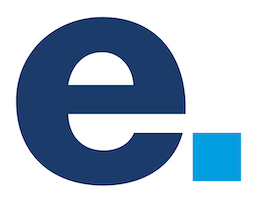

Bellow you can find a selection of interesting projects on which I have participated or I am currently developing them.

If you are interested in my personal dev stack just [check out what I am using](/uses).

  

## Projects at LMC

- [Check out company's dev stack](https://stackshare.io/literat/lmc-s-r-o)

### React & NodeJS Technology Owner

Taking care of Node.js and React technologies in a company. Helping teams to adopt those technologies. Preparing courses, meetings and talks about Node.js, React and Frontend technology stack. Maintaining tools and instructions for those technologies like company base Node.js Docker images or ESLint rulesets.

<t>javascript, typescript, node.js, react, docker, eslint, prettier</t>

### Spirit Design system

Spirit is an open-source design system developed by LMC.

- [Spirit Design System Documentation](https://github.com/lmc-eu/spirit-design-system)
- [Spirit Design System Demo](https://lmc-eu.github.io/spirit-design-system/web/)

<t>sass, css, javascript, typescript, react, components, design system, lerna, monorepo, github, npm</t>

### Code Quality Tools

Monorepo which contains shareable configurations for various coding-style/best practices/lint tools to make the configurations consistent across projects and provide easy setup mechanism.

- [Code Quality Tools Documentation](https://github.com/lmc-eu/code-quality-tools)

<t>
  javascript, typescript, react, eslint, stylelint, renovate, conventional commits, changelog, monorepo, github, npm
</t>

### Cookie Consent Manager

Configurable cookie consent banner with the predefined company defaults.

- [Cookie Consent Manager Documentation](https://github.com/lmc-eu/cookie-consent-manager)

<t>javascript, typescript, esbuild, sass, npm, github</t>

### Medallions, Company profiles, Career Sections Widget

Refactoring monolith application into microservices for better customization and future development. Providing API (Graphql and REST) and library (Symfony bundle) as a service to both jobboards (Jobs.cz, Prace.cz) and integrate admin panel (SPA, React) to Teamio application dashboard.

- [Snippet Documentation](https://snippet.capybara.lmc.cz/)

<t>php7, symfony, postgresql, docker, react, apollo, graphql, spa, bundle</t>

  

## Projects at Economia

- [Check out comapny's dev stack](https://stackshare.io/literat/economia-a-s)

### Homepages

Reimplementation of Centrum.cz, Atlas.cz and Volny.cz homepages to server side rendered pages using Node.js and React. Cached and hosted from AWS.
[Read an article about it of my collegue.](https://nadsenyvyvojar.cz/kdyz-refactoring-neni-reseni-aneb-nove-centrum-cz/)

- [Centrum Homepage](https://www.centrum.cz/)
- [Atlas Homepage](https://www.atlas.cz/)
- [Volny Homepage](https://www.volny.cz/)

<t>node.js, react, aws, ecs</t>

### Selfcare Portal

Simple SPAs for managing subscriptions for Economia's news portals.

- [Economia Account](https://ucet.economia.cz/)
- [IHned Account](https://ucet.ihned.cz/)
- [Respekt Account](https://ucet.respekt.cz/)

<t>react, php7, laravel lumen framework, rest api, docker, aws</t>

### Content Service

Group of RESTful APIs for distributing news content accross Economia's websites. API which includes login (SSO), sessions, customer information, orders management and paywall management.

<t>php7, laravel, lumen, docker, aws, ecs, rest, mysql</t>

### Video Processing Platform

Implementing new encoding process using CDN77's encoding api and distributing video content from its CDN.
Responsibility for delivering newly created video or audio from editor through encoding process and importing to newssite's CMS for later use (all done automagically).

- [Video Aktualne](https://video.aktualne.cz)

<t>php7, laravel lumen framework, docker, codeship, aws, api gateway, lambda, ecs</t>

### Aktualne.cz and Ihned.cz

Maintenance and development of Economia's main news sites. From frontend over backend to devops. Multiple redesigns.

- [Aktualne News](https://www.aktualne.cz)
- [IHned News](https://www.ihned.cz)

<t>php5, mysql, html, css, jquery</t>

  

## Projects at Junak - czech scout

- [Check out company's dev stack](https://stackshare.io/literat/junak-cesky-skaut-z-s)

### Various Redesigns

Webdesign and HTML coding, developing on CMS Wordpress, maintaining and administration.

- [Poutnici Kolin - Scout Unit](https://poutnicikolin.cz)
- [Drager - Summer Course](https://drager.skauting.cz)
- [Navigamus - Scout Event](https://navigamus.cz)

<t>html, css, wordpress, jquery, php5, mysql</t>

### Registration System for Water Scouts Meetings

Developing CMS for registration of visitors to seminars and programs. Lectors can create and maintain programs and create entire Schedule of the Meeting. System can also export data, create tickets, lists of visitors and billing.

<t>php5, mysql, nette, jquery</t>
